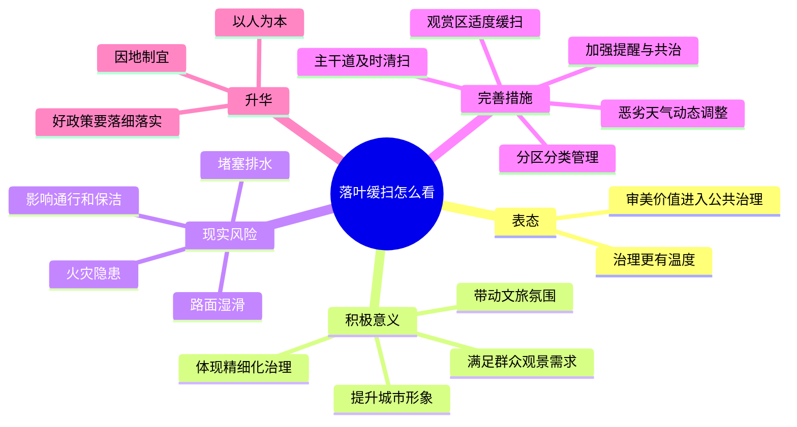

# 2026-03-29 每日一道结构化面试真题

## 1. 题目来源

说明：结构化面试真题通常不会由招录单位完整公开发布，以下内容按公开可检索页面交叉核验，且页面均标注为“真题”“网友回忆版”或“考生回忆版”，不属于机构模拟题。

- 来源 1：[爱真题：2024安徽省考面试真题及答案解析（5月14日）](https://www.aipta.com/article/9550.html)
- 来源 2：[职场密码-面试题库：2020-2024安徽省公务员考试面试真题（网友分享版）及答案深度解析](https://mianti.zcmima.cn/gongkaomianshi/207265.html)

## 2. 考试时间

2024 年 5 月 14 日  
安徽省考公务员面试

## 3. 题目

近年来，多个城市推出了类似“落叶不扫”“落叶缓扫”的政策，让更多的百姓欣赏到美好的自然风光。结合实际，谈谈你的看法。

## 4. 解题思路

### 4.1 审题拆解

这是一道典型的社会现象类综合分析题。答题核心不在于单纯表扬政策“有创意”，而在于说明：

1. 这项做法体现了什么样的治理理念。
2. 它给群众、城市治理、城市形象带来了哪些积极意义。
3. 这项政策不能一刀切，仍然要兼顾安全、卫生、通行等现实问题。
4. 最后要落到“如何把好事办好”的具体措施上。

### 4.2 作答框架

建议按“五步法”展开：

1. 表态：肯定“落叶缓扫”体现了治理温度和精细化思维。
2. 论意义：从群众体验、城市审美、文旅氛围、治理转型几个角度分析。
3. 讲边界：指出湿滑、火灾、过敏、交通影响等现实风险。
4. 提对策：分类分区、动态清扫、安全提示、公众参与、长效机制。
5. 再升华：回到“以人为本、精细治理、城市文明”。

### 4.3 思维导图

### 4.4 可以参考的答题模板

各位考官，我认为“落叶不扫”“落叶缓扫”是一项有温度、有审美、也有治理智慧的创新举措。过去我们往往把城市管理简单理解为“越整齐越好”，而这项政策说明，现代城市治理不只是追求整洁统一，还要兼顾群众体验、生态美感和公共服务品质。

一方面，这项做法能够让群众更直接地感受到季节之美，提升城市的人文气息和生活幸福感；另一方面，它也体现出政府治理理念正在从“一刀切”向“精细化、差异化”转变。当然也要看到，落叶如果长期堆积，可能带来湿滑摔倒、堵塞排水、火灾隐患等问题。因此，这项政策不能简单照搬，而要坚持因地制宜、分类施策。

我认为，下一步应当从分区分类管理、动态清扫机制、安全提示引导、群众共同参与等方面发力，让“落叶缓扫”既保留城市美感，也守住安全底线，真正把好事办好、实事办实。

## 5. 参考答案

各位考官，我认为“落叶不扫”“落叶缓扫”是一项值得肯定的城市治理创新。它表面上看是一种保洁方式的调整，实质上反映的是城市治理理念的变化，也就是从单一追求整齐划一，转向更加注重群众感受、生态美感和精细服务。

首先，这项政策体现了治理温度。秋冬时节，层层落叶本身就是城市景观的一部分。适度保留落叶，能够让群众更好地感受自然变化，增强生活中的审美体验，也让城市更具烟火气和人情味。

其次，这项政策体现了治理思维的升级。过去一些地方在城市管理中习惯于“一把尺子量到底”，而“落叶缓扫”说明政府开始根据道路性质、群众需求和景观效果进行差异化管理，这正是精细化治理的体现。对于一些景观道路、公园绿地、游客集中的区域，适当缓扫可以提升城市形象，也有助于塑造城市品牌。

但与此同时，我们也要看到，“落叶缓扫”不是“不管不问”。如果机械照搬，也可能带来一些现实问题。比如，雨雪天气下落叶容易导致路面湿滑；落叶堆积可能堵塞排水口；在一些重点区域还可能带来火灾隐患；如果主干道、医院、学校周边也长期不清扫，还会影响通行秩序和群众体验。

因此，我认为这项政策要想真正落地见效，关键是做到以下几点：

第一，分区分类管理。景观道路、公园绿地、文旅街区可以实行“缓扫”或“留景”，而交通主干道、学校医院周边、坡道桥梁等重点区域必须及时清扫，守住安全底线。

第二，建立动态机制。根据天气情况、客流情况和季节变化灵活调整。晴天可适当留景，遇到大风、降雨、降雪等情况要及时清扫，避免安全风险。

第三，加强安全提示和宣传引导。通过提示牌、公众号、媒体宣传等方式，让群众理解政策初衷，同时提醒老人、儿童等群体注意防滑，形成共识。

第四，推动多方参与。可以发动社区、志愿者、环卫部门和市民共同参与景观维护，让群众既是欣赏者，也是城市治理的参与者。

总的来看，“落叶缓扫”启示我们，好的城市治理不是简单地把城市管得一尘不染，而是在整洁、安全与美感之间找到平衡，在标准化管理与个性化服务之间找到结合点。只有坚持以人为本、因地制宜、精细落实，才能让这样的政策真正赢得群众认可。

## 6. 录制的口播稿

> PPT 共 8 页，翻页点用 **【→ 翻页】** 标注。

---

**【第 1 页 · 封面】**

今天这道题，来自 2024 年 5 月 14 日安徽省考公务员面试真题。我交叉比对了爱真题和职场密码面试题库两个页面，都标注为真题或网友回忆版，基本可以排除机构模拟题。

**【→ 翻页】**

---

**【第 2 页 · 题目】**

我们来看题目。近年来，多个城市推出了类似”落叶不扫””落叶缓扫”的政策，让更多百姓欣赏到美好的自然风光。结合实际，谈谈你的看法。

这是一道典型的社会现象类综合分析题。答题核心不在于简单表扬这个政策有创意，而在于把背后的治理逻辑讲清楚。

**【→ 翻页】**

---

**【第 3 页 · 审题拆解】**

审题可以分四层来抓。第一层，这项做法体现了什么样的治理理念——它反映出城市治理不再只追求机械式的整齐划一，而是开始更加重视群众感受和公共服务品质。第二层，要讲清楚它带来的积极意义，不能只说一句”这个政策很好”，要展开说明它对群众、对城市治理、对城市形象有什么正面作用。第三层，要讲清楚这项政策不能一刀切，落叶虽然有景观价值，但也涉及安全、卫生、通行等现实问题，不能只讲浪漫，不讲管理。第四层，最后一定要落到”怎么把好事办好”的具体措施上，体现解决问题的能力。

**【→ 翻页】**

---

**【第 4 页 · 作答框架·五步法】**

这道题建议用”五步法”来展开。第一步，表态——开头就明确肯定”落叶缓扫”体现了治理温度和精细化思维。第二步，论意义——从群众体验、城市审美、文旅氛围、治理转型几个角度展开分析。第三步，讲边界——指出湿滑、火灾、堵塞排水、影响通行等现实风险，综合分析题不能只说好话。第四步，提对策——分区分类、动态清扫、安全提示、公众参与、长效机制。第五步，再升华——回到”以人为本、精细治理、城市文明”。

**【→ 翻页】**

---

**【第 5 页 · 思维导图】**

如果画成思维导图，中间就是”落叶缓扫怎么看”。第一个分支”表态”，治理更有温度、审美价值进入公共治理。第二个分支”积极意义”，满足群众观景需求、提升城市形象、体现精细化治理、带动文旅氛围。第三个分支”现实风险”，路面湿滑、堵塞排水、火灾隐患、影响通行和保洁。第四个分支”完善措施”，分区分类管理、主干道及时清扫、观赏区适度缓扫、恶劣天气动态调整、加强提醒与共治。最后升华：以人为本、因地制宜、好政策要落细落实。

好，以上就是这道题的解题思路。下面我们来看参考答案。

**【→ 翻页】**

---

**【第 6 页 · 参考答案 1/2】**

各位考官，我认为”落叶不扫””落叶缓扫”是一项值得肯定的城市治理创新。它表面上看是一种保洁方式的调整，实质上反映的是城市治理理念的变化，也就是从单一追求整齐划一，转向更加注重群众感受、生态美感和精细服务。

首先，这项政策体现了治理温度。秋冬时节，层层落叶本身就是城市景观的一部分。适度保留落叶，能够让群众更好地感受自然变化，增强生活中的审美体验，也让城市更具烟火气和人情味。

其次，这项政策体现了治理思维的升级。过去一些地方在城市管理中习惯于”一把尺子量到底”，而”落叶缓扫”说明政府开始根据道路性质、群众需求和景观效果进行差异化管理，这正是精细化治理的体现。对于一些景观道路、公园绿地、游客集中的区域，适当缓扫可以提升城市形象，也有助于塑造城市品牌。

但与此同时，我们也要看到，”落叶缓扫”不是”不管不问”。如果机械照搬，也可能带来一些现实问题。比如，雨雪天气下落叶容易导致路面湿滑；落叶堆积可能堵塞排水口；在一些重点区域还可能带来火灾隐患；如果主干道、医院、学校周边也长期不清扫，还会影响通行秩序和群众体验。

因此，我认为这项政策要想真正落地见效，关键是做到以下几点：

**【→ 翻页】**

---

**【第 7 页 · 参考答案 2/2】**

第一，分区分类管理。景观道路、公园绿地、文旅街区可以实行”缓扫”或”留景”，而交通主干道、学校医院周边、坡道桥梁等重点区域必须及时清扫，守住安全底线。

第二，建立动态机制。根据天气情况、客流情况和季节变化灵活调整。晴天可适当留景，遇到大风、降雨、降雪等情况要及时清扫，避免安全风险。

第三，加强安全提示和宣传引导。通过提示牌、公众号、媒体宣传等方式，让群众理解政策初衷，同时提醒老人、儿童等群体注意防滑，形成共识。

第四，推动多方参与。可以发动社区、志愿者、环卫部门和市民共同参与景观维护，让群众既是欣赏者，也是城市治理的参与者。

总的来看，”落叶缓扫”启示我们，好的城市治理不是简单地把城市管得一尘不染，而是在整洁、安全与美感之间找到平衡，在标准化管理与个性化服务之间找到结合点。只有坚持以人为本、因地制宜、精细落实，才能让这样的政策真正赢得群众认可。

**【→ 翻页】**

---

**【第 8 页 · CTA】**

好，以上就是今天的每日一道结构化面试真题。觉得有用的话，点赞、收藏、关注，我们明天继续。
