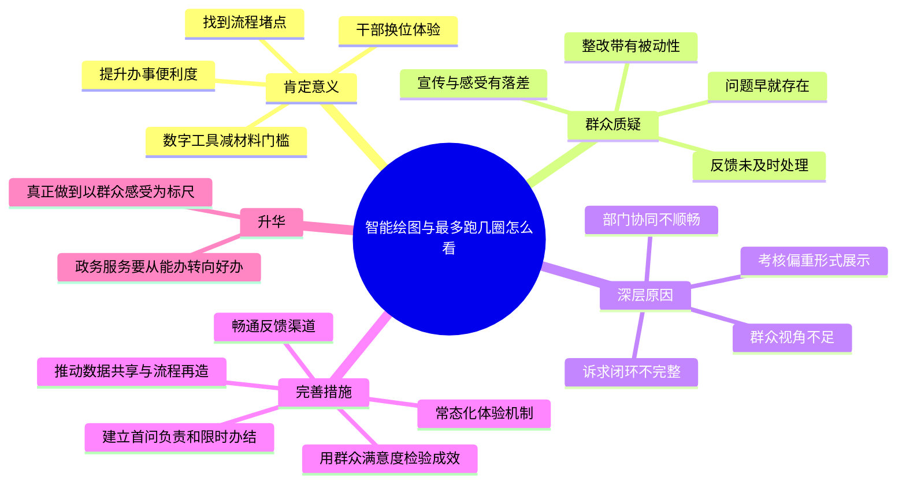

# 2026-03-30 每日一道结构化面试真题

## 1. 题目来源

说明：结构化面试真题通常不会由招录单位完整公开发布，以下内容按公开可检索页面交叉核验，且页面均标注为“真题”“题目回忆版”或“来源于考生回忆及网络”，不属于机构模拟题。

- 来源 1：[国家公务员考试网：2025年江苏公务员考试面试真题（3月8日）](https://www.chinagwy.org/html/msxg/mnt/202503/214_665867.html)
- 来源 2：[公务员事业单位最新题库：2025年3月8日江苏省考公务员面试题（C类）](https://www.gwysydw.com/ms/dqgwy/news_251449.html)
- 来源 3：[爱真题：2025江苏省考面试真题及答案解析（3月8日C类）](https://www.aipta.com/article/10112.html)

## 2. 考试时间

2025 年 3 月 8 日  
江苏省公务员考试面试 C 类

## 3. 题目

某地开展机关干部“体验跑一次”行动，目的是让干部站在群众角度体验办事流程。体验中发现，群众在办理相关事项时，常因不会绘制平面图、材料反复退回等问题来回跑。相关部门随后上线“智能绘图”程序，问题得到一定解决，也收获了不少点赞；但与此同时，也有群众质疑：这些问题此前就反馈过，为什么非要等干部体验后才改？甚至有人调侃“最多跑一次”变成了“跑几圈”。请谈谈你的看法。

## 4. 解题思路

### 4.1 审题拆解

这是一道典型的政务服务类综合分析题，答题不能只停留在“肯定创新”或者“批评不足”任一侧，而要把两面都讲透。

1. 要先肯定“体验跑一次”和“智能绘图”背后的积极意义，说明干部换位体验、技术赋能服务，方向是对的。
2. 也要指出群众吐槽折射出更深层问题，即群众诉求传导不畅、问题整改滞后、服务优化存在被动性。
3. 进一步分析为什么会出现“干部一体验就解决，群众之前反映却没解决”的现象，本质上是群众视角不足、反馈闭环不完善、考核导向偏结果展示。
4. 最后要落到改进措施，体现既能看问题，也能提出可操作方案。

### 4.2 作答框架

建议按“五步法”展开：

1. 表态：肯定换位体验和技术优化的积极作用。
2. 讲意义：体现群众视角、流程再造、数字赋能。
3. 点问题：群众早反映却迟迟未解决，说明作风和机制仍有短板。
4. 挖根源：问题发现机制不主动、诉求办理不闭环、考核重宣传轻实效。
5. 提对策：主动发现、立行立改、全程回访、数据共享、常态长效。

### 4.3 思维导图

### 4.4 可以参考的答题模板

各位考官，我认为这件事既值得肯定，也值得反思。值得肯定的是，干部通过“体验跑一次”真正发现了群众办事中的堵点，并借助“智能绘图”等数字化手段提升了办事便利度，这说明政务服务改革方向是对的。值得反思的是，群众此前已经多次反映问题，却迟迟没有得到解决，直到干部亲身体验后才推动整改，这说明一些地方在服务群众时还存在问题发现不主动、诉求回应不及时、整改机制不完善等短板。

因此，对这件事既要看到“改得快”的积极一面，更要看到“为什么以前没改”的深层问题。下一步，应当坚持以群众感受为标尺，推动从被动整改向主动发现转变，从单点优化向系统再造转变，从宣传式改进向长效化服务转变，真正把“最多跑一次”落到群众真实体验上。

## 5. 参考答案

各位考官，我认为这件事要辩证来看，既应肯定，也必须反思。

先说值得肯定的地方。某地开展机关干部“体验跑一次”行动，本身就是一种很好的工作方法。干部通过亲身体验办事流程，能够更直观地发现群众办事过程中的堵点、难点和痛点，避免坐在办公室里想当然决策。之后相关部门推出“智能绘图”程序，帮助群众解决不会画图、材料反复退回的问题，也说明当地能够借助数字化手段优化服务流程，提升办事便利度。这些举措说明，政务服务改革正在从“能办”向“好办、快办”迈进。

但群众的质疑同样值得高度重视。群众反映“这些问题早就存在，之前也反馈过，为什么非要等干部体验后才改”，甚至调侃“最多跑一次”成了“跑几圈”，这说明问题并不只是一个绘图程序没有上线那么简单，而是折射出一些地方在服务群众上仍然存在短板。

第一，说明问题发现机制还不够主动。群众天天在办事窗口跑，对堵点最有感受，但这些问题没有被及时发现、及时解决，说明部分部门还是缺少真正站在群众角度审视流程的意识。

第二，说明群众诉求办理闭环还不够完整。群众反映过问题，却没有形成“收集、研判、整改、反馈、回访”的完整链条，导致意见停留在“听到了”，却没有落实到“解决了”。

第三，说明有的地方在改革推进中还存在被动整改甚至重展示、轻平时的问题。一旦干部亲自体验或媒体关注，就迅速整改并宣传；但在日常工作中，对群众反映的问题重视不够，这种反差会削弱群众对政务服务改革的信任感。

我认为，下一步应从以下几个方面改进。

第一，把“体验跑一次”变成常态机制，而不是一次性活动。可以让领导干部、窗口单位负责人、业务骨干定期以普通群众身份体验办事流程，持续发现问题、推动优化。

第二，畅通群众反馈渠道，建立问题闭环。对群众通过热线、窗口、政务平台提出的高频问题，要及时汇总分析，明确责任部门和整改时限，并把处理结果反馈给群众，真正做到件件有着落、事事有回应。

第三，推动流程再造和数字赋能同步发力。像“智能绘图”这样的技术工具值得推广，但更重要的是系统梳理哪些材料可以减、哪些流程可以并、哪些数据可以共享，不能只靠一个程序修补局部问题，而要从源头上减少群众来回跑。

第四，把群众满意度作为检验标准。改革成效不能只看报道多不多、点赞高不高，更要看群众是不是少跑了腿、少费了心、少等了时间。只有把群众真实感受纳入考核，才能倒逼服务真正落细落实。

总的来看，这件事给我们的启示是，政务服务改革不能满足于“干部发现问题后迅速整改”，更要建立起“群众一有感受、部门就有回应”的治理机制。只有真正以群众感受为标尺，把问题解决在平时、把服务做在前面，才能让“最多跑一次”不止停留在口号上，而成为群众可感可及的办事体验。

## 6. 录制的口播稿

> PPT 共 8 页，翻页点用 **【→ 翻页】** 标注。

---

**【第 1 页 · 封面】**

今天这道题，来自 2025 年 3 月 8 日江苏省公务员考试面试 C 类真题。我交叉比对了国家公务员考试网、公务员事业单位最新题库和爱真题三个页面，都标注为真题或考生回忆版，基本可以排除机构模拟题。

**【→ 翻页】**

---

**【第 2 页 · 题目】**

我们来看题目。某地开展机关干部”体验跑一次”行动，干部体验后发现群众办事时经常因为不会绘图、材料退回等问题来回折腾，于是部门上线了”智能绘图”程序，得到不少点赞；但群众又质疑，这些问题以前就反馈过，为什么非得等干部体验了才改，甚至有人吐槽”最多跑一次”变成了”跑几圈”。让你谈谈看法。

这道题本质上是一道政务服务类综合分析题，答题不能只讲一面——既不能一味夸”数字化真先进”，也不能只盯着群众吐槽去批评，要把肯定和反思都讲透。

**【→ 翻页】**

---

**【第 3 页 · 审题拆解】**

审题可以分四层来抓。第一层，肯定”体验跑一次”和”智能绘图”这两个动作，前者体现干部换位思考，后者体现技术赋能，方向是对的。第二层，看群众为什么不完全买账——他们真正介意的不是问题现在解决了，而是以前反映的时候为什么没有及时解决。第三层，继续往下挖根源：群众视角不足、反馈闭环不完整、部门整改偏被动、考核有时重展示轻实效。第四层，最后一定要落到具体改进办法，体现解决问题的能力。

**【→ 翻页】**

---

**【第 4 页 · 作答框架·五步法】**

这道题建议用”五步法”来展开。第一步，表态——肯定换位体验和技术优化的积极作用。第二步，讲意义——体现群众视角、流程再造、数字赋能。第三步，点问题——群众早就反映却迟迟未解决，说明作风和机制仍有短板。第四步，挖根源——问题发现不主动、诉求办理不闭环、考核重宣传轻实效。第五步，提对策——主动发现、立行立改、全程回访、数据共享、常态长效。

**【→ 翻页】**

---

**【第 5 页 · 思维导图】**

如果画成思维导图，中间就是”智能绘图与最多跑几圈怎么看”。第一个分支”肯定意义”，包括干部换位体验、发现流程堵点、数字工具降低门槛、提升办事便利度。第二个分支”群众质疑”，包括问题早就存在、反馈没及时处理、整改带有被动性、宣传和真实感受有落差。第三个分支”深层原因”，包括群众视角不足、诉求闭环不完整、部门协同不顺畅、考核偏重形式展示。第四个分支”完善措施”，包括常态化体验机制、畅通反馈渠道、建立限时办结、推动数据共享和流程再造、用群众满意度检验成效。最后升华一句话：政务服务要从”能办”真正走向”好办”，把群众感受作为标尺。

好，以上就是这道题的解题思路。下面我们来看参考答案。

**【→ 翻页】**

---

**【第 6 页 · 参考答案 1/2】**

各位考官，我认为这件事要辩证来看，既应肯定，也必须反思。

先说值得肯定的地方。某地开展机关干部”体验跑一次”行动，本身就是一种很好的工作方法。干部通过亲身体验办事流程，能够更直观地发现群众办事过程中的堵点、难点和痛点，避免坐在办公室里想当然决策。之后相关部门推出”智能绘图”程序，帮助群众解决不会画图、材料反复退回的问题，也说明当地能够借助数字化手段优化服务流程，提升办事便利度。这些举措说明，政务服务改革正在从”能办”向”好办、快办”迈进。

但群众的质疑同样值得高度重视。群众反映”这些问题早就存在，之前也反馈过，为什么非要等干部体验后才改”，甚至调侃”最多跑一次”成了”跑几圈”，这说明问题并不只是一个绘图程序没有上线那么简单，而是折射出一些地方在服务群众上仍然存在短板。

第一，说明问题发现机制还不够主动。群众天天在办事窗口跑，对堵点最有感受，但这些问题没有被及时发现、及时解决，说明部分部门还是缺少真正站在群众角度审视流程的意识。

第二，说明群众诉求办理闭环还不够完整。群众反映过问题，却没有形成”收集、研判、整改、反馈、回访”的完整链条，导致意见停留在”听到了”，却没有落实到”解决了”。

第三，说明有的地方在改革推进中还存在被动整改甚至重展示、轻平时的问题。一旦干部亲自体验或媒体关注，就迅速整改并宣传；但在日常工作中，对群众反映的问题重视不够，这种反差会削弱群众对政务服务改革的信任感。

我认为，下一步应从以下几个方面改进。

第一，把”体验跑一次”变成常态机制，而不是一次性活动。可以让领导干部、窗口单位负责人、业务骨干定期以普通群众身份体验办事流程，持续发现问题、推动优化。

第二，畅通群众反馈渠道，建立问题闭环。对群众通过热线、窗口、政务平台提出的高频问题，要及时汇总分析，明确责任部门和整改时限，并把处理结果反馈给群众，真正做到件件有着落、事事有回应。

第三，推动流程再造和数字赋能同步发力。像”智能绘图”这样的技术工具值得推广，但更重要的是系统梳理哪些材料可以减、哪些流程可以并、哪些数据可以共享，不能只靠一个程序修补局部问题，而要从源头上减少群众来回跑。

第四，把群众满意度作为检验标准。改革成效不能只看报道多不多、点赞高不高，更要看群众是不是少跑了腿、少费了心、少等了时间。只有把群众真实感受纳入考核，才能倒逼服务真正落细落实。

**【→ 翻页】**

---

**【第 7 页 · 参考答案 2/2】**

总的来看，这件事给我们的启示是，政务服务改革不能满足于”干部发现问题后迅速整改”，更要建立起”群众一有感受、部门就有回应”的治理机制。只有真正以群众感受为标尺，把问题解决在平时、把服务做在前面，才能让”最多跑一次”不止停留在口号上，而成为群众可感可及的办事体验。

**【→ 翻页】**

---

**【第 8 页 · CTA】**

好，以上就是今天的每日一道结构化面试真题。觉得有用的话，点赞、收藏、关注，我们明天继续。
