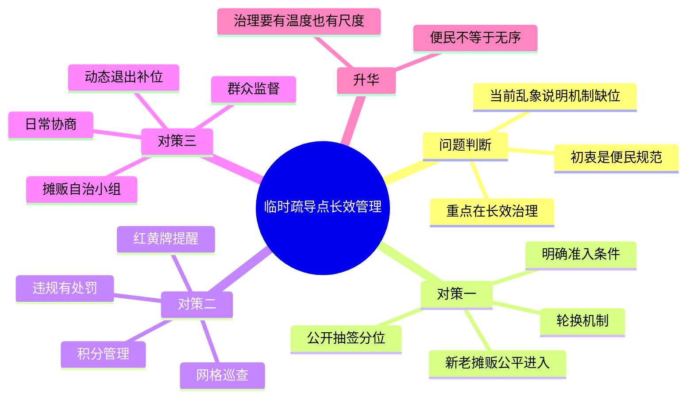

# 2026-03-31 每日一道结构化面试真题

## 1. 题目来源

说明：结构化面试真题通常不会由招录单位完整公开发布，以下内容按公开可检索页面交叉核验，且页面均标注为“面试真题”“考生回忆版”或“真题及答案解析”，不属于机构模拟题。

- 来源 1：[爱真题：2025江苏省考面试真题及答案解析（3月9日B类）](https://www.aipta.com/article/10450.html)
- 来源 2：[考考公务员：2025年3月9日江苏省考面试题（考生回忆版）](https://www.kkgwy.com/ms/zt/228629.html)
- 来源 3：[公务员事业单位最新题库：2025年3月9日江苏省考公务员面试题（B类）](https://www.gwysydw.com/ms/dqgwy/news_251462.html)
- 来源 4：[面试帮：2025年3月9日江苏省考公务员面试题（B类）](https://blog.sina.com.cn/s/blog_17bace72101034xca.html)

## 2. 考试时间

2025 年 3 月 9 日  
江苏省公务员考试面试 B 类

## 3. 题目

政府为了方便摆摊设置了临时疏导点，在落实的过程中，存在一些摊贩拉帮结派、抢好位置、排挤新来摊贩、不服管理的情况。从长效管理的角度，请你提出三个具体的对策。

## 4. 解题思路

### 4.1 审题拆解

这是一道典型的基层治理类对策题，答题重点不是泛泛而谈“加强管理”，而是要紧扣“长效管理”和“三个具体对策”两个关键词，既回应现实乱象，又体现制度化、可执行、可持续。

1. 要先点明临时疏导点的初衷是便民利民、规范经营，因此答题基调应当是“肯定初衷、解决问题、完善机制”。
2. 题干中的拉帮结派、抢占位置、排挤新人、不服管理，反映的不是单一摊贩素质问题，而是准入规则不清、现场管理不细、协同治理不足。
3. “长效管理”意味着提出的对策不能只靠一次整治，而要包含公开规则、日常约束、自治共管、动态退出等制度安排。
4. “三个具体对策”最好一策解决一类核心问题，彼此之间形成闭环，避免三个措施内容重复、层次混乱。

### 4.2 作答框架

建议按“五步法”展开：

1. 开篇定性：肯定设置疏导点的出发点，指出当前问题本质是管理机制没有及时跟上。
2. 对策一：建立公开公平的准入和摊位分配机制，解决抢位置、排挤新人问题。
3. 对策二：健全现场巡查和积分奖惩机制，解决不服管理、秩序混乱问题。
4. 对策三：推动摊贩自治与多方共管，建立诉求协商和动态退出机制，形成长效闭环。
5. 总结升华：实现便民、惠民、规范经营和城市秩序的统一。

### 4.3 思维导图

### 4.4 可以参考的答题模板

各位考官，我认为政府设置临时疏导点，初衷是方便群众生活、保障摊贩经营、减少占道经营带来的管理压力，这一方向值得肯定。当前出现拉帮结派、抢占位置、排挤新人、不服管理等问题，说明疏导点建设已经从“有没有”进入到“怎么管好”的阶段。

如果让我提出对策，我会围绕公平准入、规范管理、共建共治三个方面发力。首先，通过明确准入标准、公开分配摊位、实行动态轮换，确保机会公平；其次，通过巡查管理、积分奖惩、刚性约束，确保秩序稳定；最后，通过自治协商、群众监督、动态退出，推动疏导点从临时安置走向长效治理，真正实现便民不扰民、放活不放乱。

## 5. 参考答案

各位考官，我认为，政府设置临时疏导点，本意是为了方便群众生活、拓宽群众就业渠道，同时把零散摊点引导到相对规范的区域经营，这个出发点是好的，也体现了城市治理的温度。

但题干中出现的拉帮结派、抢好位置、排挤新来摊贩、不服管理等现象说明，疏导点虽然建起来了，但相应的管理机制还没有同步完善。要实现长效管理，我认为可以从以下三个方面发力。

第一，建立公开透明的准入和摊位分配机制，从源头上解决“谁能进、怎么摆、凭什么占好位置”的问题。对于进入疏导点经营的摊贩，要明确申请条件、经营品类、经营时段等基本规则，统一登记备案。对于摊位分配，不能默许“先来先占”“熟人优先”，而应采取公示空位、公开抽签、动态轮换等方式，让新老摊贩在同一规则下竞争。这样既能压缩拉帮结派的空间，也能减少因为分配不公引发的矛盾。

第二，建立常态化的现场管理和积分奖惩机制，从过程上解决“不服管理、秩序混乱”的问题。可以由城管、街道、社区联合组成日常巡查力量，对摊贩经营时间、经营区域、环境卫生、噪音控制等进行常态化检查。同时，对摊贩实行积分管理，对遵规守纪、文明经营的给予优先续位、评优激励；对争抢摊位、排挤他人、拒不服从管理的，采取提醒约谈、扣分整改、暂停经营资格等措施。通过奖惩并举，把“要我守规矩”转变为“守规矩才有长期收益”。

第三，建立摊贩自治和多方共治机制，从长远上解决“管理力量有限、矛盾反复发生”的问题。可以在疏导点内推选摊贩代表，成立自治小组，协助开展秩序维护、矛盾调解和文明宣传，让管理从单向约束转向共同参与。同时，畅通群众、周边商户和摊贩本人的反馈渠道，对高频问题及时会商处理。对于长期违规、屡教不改的摊贩，要建立动态退出机制；对于空出的摊位，要及时按规则补位。这样才能形成“有进入、有规范、有退出”的完整闭环。

我认为，临时疏导点的治理，关键不在于一时整治，而在于制度建设。只有把公平规则立起来、把日常管理严起来、把自治共管用起来，才能真正实现便民惠民与规范有序并重，让城市既有烟火气，也有好秩序。

## 6. 录制的口播稿

> PPT 共 8 页，翻页点用 **【→ 翻页】** 标注。

---

**【第 1 页 · 封面】**

今天这道题，来自 2025 年 3 月 9 日江苏省公务员考试面试 B 类真题。我交叉比对了爱真题、考考公务员、公务员事业单位最新题库和面试帮四个公开页面，这些页面都把内容标注为面试真题、考生回忆版或者真题及答案解析，基本可以排除机构模拟题。

**【→ 翻页】**

---

**【第 2 页 · 题目】**

我们先来看题目。政府为了方便摆摊设置了临时疏导点，但在落实过程中，出现了一些摊贩拉帮结派、抢好位置、排挤新来摊贩、不服管理的情况。题目要求你从长效管理的角度，提出三个具体对策。

这道题本质上是一道基层治理类对策题。答题时不能只停留在一句“加强管理”，而是要真正回答清楚三个问题：第一，这些乱象背后的管理症结是什么；第二，三个对策分别对应解决什么问题；第三，怎么体现长效治理而不是一阵风整治。

**【→ 翻页】**

---

**【第 3 页 · 审题拆解】**

审题时重点抓四层。第一层，要先肯定设立临时疏导点的初衷，它本身是便民利民、规范经营的治理举措。第二层，要看到题干里的乱象不是单个摊贩的问题，而是规则不清、管理不细、共治不足的综合反映。第三层，要扣住“长效管理”这个关键词，所以对策一定要带制度设计，不能只说“加强教育”“加大处罚”。第四层，要注意题目明确要求“三个具体对策”，所以答题结构最好是一策解决一类核心问题，层次清楚，彼此不重复。

**【→ 翻页】**

---

**【第 4 页 · 作答框架·五步法】**

这道题可以按五步法来答。第一步，开篇定性，肯定疏导点的治理初衷，同时指出当前问题说明管理机制没有及时跟上。第二步，提出第一个对策，围绕公平准入和公开分配，解决抢位置、排挤新人的问题。第三步，提出第二个对策，围绕现场巡查和积分奖惩，解决不服管理、秩序混乱的问题。第四步，提出第三个对策，围绕摊贩自治、多方共治和动态退出，解决矛盾反复、管理不可持续的问题。第五步，结尾升华，回到便民、惠民、规范经营和城市秩序的统一。

这里还可以直接套用一个答题模板。比如开头可以这样说：我认为，设置临时疏导点的方向值得肯定，但要想真正便民利民，关键不只是把摊贩集中起来，更要通过公平准入、规范管理、共建共治，把疏导点从临时安置点变成长效治理点。

**【→ 翻页】**

---

**【第 5 页 · 思维导图】**

如果把这道题画成思维导图，中间就是“临时疏导点长效管理”。第一部分是问题判断，重点在于明确初衷是便民规范，当前乱象说明机制缺位，答题重点是长效治理。第二部分是对策一，关键词是明确准入条件、公开抽签分位、建立轮换机制，保障新老摊贩公平进入。第三部分是对策二，关键词是网格巡查、积分管理、红黄牌提醒和违规处罚。第四部分是对策三，关键词是摊贩自治小组、日常协商、群众监督和动态退出补位。最后升华一句，便民不等于无序，治理既要有温度，也要有尺度。

好，以上就是这道题的来源、考试时间、题目和解题思路。下面是参考答案。

**【→ 翻页】**

---

**【第 6 页 · 参考答案 1/2】**

各位考官，我认为，政府设置临时疏导点，本意是为了方便群众生活、拓宽群众就业渠道，同时把零散摊点引导到相对规范的区域经营，这个出发点是好的，也体现了城市治理的温度。

但题干中出现的拉帮结派、抢好位置、排挤新来摊贩、不服管理等现象说明，疏导点虽然建起来了，但相应的管理机制还没有同步完善。要实现长效管理，我认为可以从以下三个方面发力。

第一，建立公开透明的准入和摊位分配机制，从源头上解决“谁能进、怎么摆、凭什么占好位置”的问题。对于进入疏导点经营的摊贩，要明确申请条件、经营品类、经营时段等基本规则，统一登记备案。对于摊位分配，不能默许“先来先占”“熟人优先”，而应采取公示空位、公开抽签、动态轮换等方式，让新老摊贩在同一规则下竞争。这样既能压缩拉帮结派的空间，也能减少因为分配不公引发的矛盾。

第二，建立常态化的现场管理和积分奖惩机制，从过程上解决“不服管理、秩序混乱”的问题。可以由城管、街道、社区联合组成日常巡查力量，对摊贩经营时间、经营区域、环境卫生、噪音控制等进行常态化检查。同时，对摊贩实行积分管理，对遵规守纪、文明经营的给予优先续位、评优激励；对争抢摊位、排挤他人、拒不服从管理的，采取提醒约谈、扣分整改、暂停经营资格等措施。

**【→ 翻页】**

---

**【第 7 页 · 参考答案 2/2】**

第三，建立摊贩自治和多方共治机制，从长远上解决“管理力量有限、矛盾反复发生”的问题。可以在疏导点内推选摊贩代表，成立自治小组，协助开展秩序维护、矛盾调解和文明宣传，让管理从单向约束转向共同参与。同时，畅通群众、周边商户和摊贩本人的反馈渠道，对高频问题及时会商处理。对于长期违规、屡教不改的摊贩，要建立动态退出机制；对于空出的摊位，要及时按规则补位。这样才能形成“有进入、有规范、有退出”的完整闭环。

我认为，临时疏导点的治理，关键不在于一时整治，而在于制度建设。只有把公平规则立起来、把日常管理严起来、把自治共管用起来，才能真正实现便民惠民与规范有序并重，让城市既有烟火气，也有好秩序。

**【→ 翻页】**

---

**【第 8 页 · CTA】**

好，以上就是今天的每日一道结构化面试真题。觉得有用的话，点赞、收藏、关注，我们明天继续。
