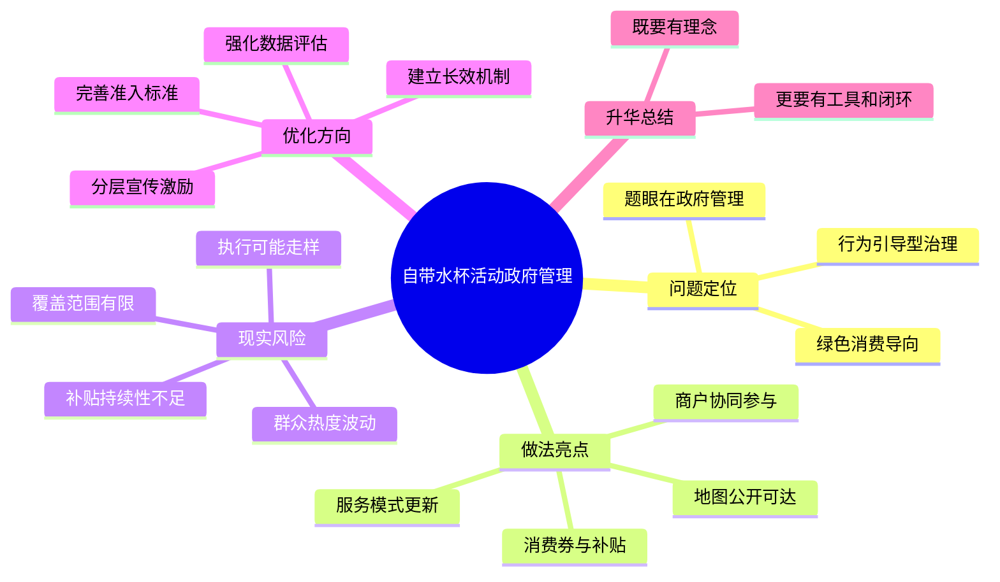

# 2026-04-02 每日一道结构化面试真题

## 1. 题目来源

说明：结构化面试真题通常不会由招录单位完整公开发布，以下内容按公开可检索页面交叉核验，且页面均标注为“面试真题”“考生回忆版”或“来源于考生回忆及网络”，不属于机构模拟题。

- 来源 1：[爱真题：2025江苏省考面试真题及答案解析（3月9日A类）](https://m.aipta.com/article/10449.html)
- 来源 2：[考考公务员：2025年3月9日江苏省考公务员面试真题（A类综合岗）](https://www.kkgwy.com/ms/zt/228628.html)
- 来源 3：[公务员事业单位最新题库：2025年3月9日江苏省考公务员面试题（A类）](https://www.gwysydw.com/ms/dqgwy/news_251463.html)
- 来源 4：[国家公务员考试网：2025年江苏公务员考试面试真题（3月9日）](https://www.chinagwy.org/html/msxg/zt/202503/55_665886.html)

## 2. 考试时间

2025 年 3 月 9 日  
江苏省公务员考试面试 A 类

## 3. 题目

为倡导绿色消费理念，保护生态环境、减少污染，某地政府开展“自带水杯”活动，积极鼓励广大群众少用一次性水杯。政府还更新管理服务模式，组织力量发布参与活动商户的分布地图和具体地点，同时配套资金支持措施，向商户发放补贴、向消费者发放消费券。对于政府的做法，请你从政府管理的角度谈谈看法。

## 4. 解题思路

### 4.1 审题拆解

这是一道典型的综合分析题，但切口不是单纯评价环保行为本身，而是要求考生站在政府管理视角，分析这项绿色消费政策的治理逻辑、现实效果和优化方向。答题时既要看到做法的积极意义，也要指出政府推动公共政策时需要把握的边界、精细化程度和长效机制。

1. 题干的核心不是“自带水杯好不好”，而是政府如何通过政策设计、场景服务和激励机制，引导群众形成绿色消费习惯。
2. 这项做法的亮点在于从“口头倡导”走向“工具赋能”，既有商户地图降低参与成本，也有消费券和补贴提升参与意愿。
3. 站在政府管理角度，不能只讲正面价值，还要看到活动可能面临覆盖面有限、补贴可持续性不足、执行跑偏和绩效评估不清等现实问题。
4. 最终落脚点要回到“好政策如何长期有效”，体现政府既是倡导者，也是组织者、服务者和评估者。

### 4.2 作答框架

建议按“五步法”展开：

1. 开篇定性：肯定政府倡导绿色消费、减少一次性用品使用的方向，指出这是一种前移治理关口的积极探索。
2. 分析亮点：强调政府把理念宣传、商户协同、地图服务和消费激励结合起来，体现了精细化治理思路。
3. 提醒风险：指出活动若只停留在短期补贴和宣传层面，可能出现参与不稳定、资源错配和政策热度退潮的问题。
4. 提出优化：围绕准入标准、数据评估、分层激励和常态宣传，说明如何把活动做深做实。
5. 总结升华：回到绿色消费要从“一次活动”变成“日常习惯”，让政策既有温度，也有持续性。

### 4.3 思维导图

### 4.4 可以参考的答题模板

各位考官，我认为这项做法总体上值得肯定。它不是简单喊口号，而是围绕绿色消费这一目标，把理念倡导、商户参与、地图服务和补贴激励结合起来，体现了政府治理方式从被动管理向主动引导转变。当然，站在政府管理角度看，这项活动要真正形成长效影响，还需要进一步解决覆盖面、可持续性和绩效评估等问题，推动绿色消费从“一阵风”变成“常态化”。

## 5. 参考答案

各位考官，我认为，政府开展“自带水杯”活动，鼓励群众减少一次性水杯使用，总体上是一次值得肯定的治理探索。这项举措顺应了绿色低碳的发展方向，也说明政府在推进生态文明建设时，已经不再满足于末端治理，而是开始把治理关口前移到消费环节和生活场景当中。

从政府管理角度看，这项做法有三个比较突出的亮点。第一，它把抽象的绿色理念转化成了群众可参与、可感知的具体行动。过去讲绿色消费，很多时候停留在宣传层面，而这次通过“自带水杯”这一具体载体，让环保从宏大理念落到了群众日常生活中。第二，它体现了服务型政府思维。政府没有只提要求，而是同步发布参与商户地图，降低群众寻找参与商户的时间成本，也便于群众把环保行为落实到实际消费场景中。第三，它体现了激励式治理思路。通过对商户发放补贴、对消费者配套消费券，把政府倡导、市场主体和公众参与联动起来，有利于提高活动的接受度和执行力。

但同时也要看到，任何一项公共政策如果想长期见效，都不能只靠一时热度。比如，参与商户覆盖面够不够广，消费券和补贴能否持续，活动过程中会不会出现“为了补贴而参与”“地图更新不及时”“前期热、后期冷”等问题，这些都决定了政策最终效果。如果这些问题处理不好，活动就可能停留在短期宣传层面，甚至造成财政资源使用效率不高、群众体验感下降。

因此，我认为下一步政府还要从三个方面继续完善。第一，完善参与商户的准入和评价机制，明确服务标准、优惠规则和退出条件，确保活动规范有序。第二，建立动态监测和数据复盘机制，根据消费券核销、商户参与率、群众反馈等数据，及时优化商户地图和支持方式，让政策更精准。第三，把活动与机关、学校、园区、商圈等更多生活场景结合起来，配套积分兑换、文明创建、绿色商户评比等机制，逐步减少对单一补贴的依赖，形成长期稳定的社会习惯。

总的来说，我认为这项做法方向是对的，关键在于把好事办得更细、更实、更长久。政府在其中既要做理念的倡导者，也要做资源的整合者、服务的提供者和效果的评估者，真正让绿色消费从“政府推动”走向“群众自觉”、从“活动尝试”走向“社会常态”。

## 6. 录制的口播稿

> PPT 共 8 页，翻页点用 **【→ 翻页】** 标注。

---

**【第 1 页 · 封面】**

今天这道题，来自 2025 年 3 月 9 日江苏省公务员考试面试 A 类。我交叉核对了爱真题、考考公务员、公务员事业单位最新题库和国家公务员考试网等公开页面，这些页面都把内容标注为面试真题、考生回忆版或者来源于考生回忆及网络，基本可以排除机构模拟题。

**【→ 翻页】**

---

**【第 2 页 · 题目】**

我们先来看题目。为倡导绿色消费理念，保护生态环境、减少污染，某地政府开展“自带水杯”活动，鼓励群众少用一次性水杯。政府还更新管理服务模式，发布参与活动商户的分布地图和具体地点，同时通过补贴和消费券进行激励。题目要求我们从政府管理的角度，谈谈对这一做法的看法。

这道题虽然看上去在谈环保，但真正的考点不是简单表态“支持环保”，而是考你能不能站在政府治理视角去分析，一项公共政策为什么值得肯定、有哪些亮点、又存在哪些需要继续完善的地方。

**【→ 翻页】**

---

**【第 3 页 · 审题拆解】**

审题时重点抓四层。第一层，这项活动本质上是行为引导型治理，不只是宣传环保，而是通过政策工具引导群众改变消费习惯。第二层，题干里的几个细节很关键，比如商户地图、具体地点、补贴和消费券，说明政府不是停留在口号层面，而是在做场景化、服务化的治理设计。第三层，站在政府管理角度，不能只讲好处，还要提醒活动可能存在覆盖面有限、补贴可持续性不足、执行走样等问题。第四层，最后必须回到长效治理，说明政府怎样把一项活动真正沉淀为长期有效的公共政策。

**【→ 翻页】**

---

**【第 4 页 · 作答框架·五步法】**

这道题可以按五步法来答。第一步，开篇定性，肯定政府倡导绿色消费、减少一次性用品使用的方向。第二步，分析亮点，说明政府把理念宣传、商户协同、地图服务和激励机制结合起来，体现了精细化治理。第三步，提醒风险，指出如果只靠短期补贴和活动热度，政策效果可能难以持续。第四步，提出优化方向，比如完善商户准入标准、强化数据评估、做好分层激励和常态宣传。第五步，结尾升华，强调绿色消费要从一次活动变成日常习惯。

这里也可以直接套用一个答题模板。比如开头可以这样说：我认为这项做法总体上值得肯定，它不是简单喊口号，而是围绕绿色消费这一目标，把理念倡导、商户参与、地图服务和补贴激励结合起来，体现了政府治理方式从被动管理向主动引导转变。

**【→ 翻页】**

---

**【第 5 页 · 思维导图】**

如果把这道题画成思维导图，中间就是“自带水杯活动政府管理”。第一部分是问题定位，强调它是绿色消费导向下的行为引导型治理，题眼在政府管理。第二部分是做法亮点，包括商户协同参与、地图公开可达、消费券与补贴、服务模式更新。第三部分是现实风险，包括覆盖范围有限、补贴持续性不足、执行可能走样、群众热度波动。第四部分是优化方向，分别是完善准入标准、强化数据评估、分层宣传激励和建立长效机制。最后升华一句，政策既要有理念，也要有工具和闭环。

好，以上就是这道题的来源、考试时间、题目和解题思路。下面是参考答案。

**【→ 翻页】**

---

**【第 6 页 · 参考答案 1/2】**

各位考官，我认为，政府开展“自带水杯”活动，鼓励群众减少一次性水杯使用，总体上是一次值得肯定的治理探索。这项举措顺应了绿色低碳的发展方向，也说明政府在推进生态文明建设时，已经不再满足于末端治理，而是开始把治理关口前移到消费环节和生活场景当中。

从政府管理角度看，这项做法有三个比较突出的亮点。第一，它把抽象的绿色理念转化成了群众可参与、可感知的具体行动。第二，它体现了服务型政府思维，政府同步发布参与商户地图，降低群众参与成本。第三，它体现了激励式治理思路，通过对商户发放补贴、对消费者配套消费券，把政府倡导、市场主体和公众参与联动起来，有利于提高活动的接受度和执行力。

**【→ 翻页】**

---

**【第 7 页 · 参考答案 2/2】**

但同时也要看到，如果一项政策想长期见效，不能只靠一时热度。比如参与商户覆盖面够不够广，补贴能否持续，地图更新是否及时，活动会不会前期热、后期冷，这些都决定了政策最终效果。因此，下一步政府还要完善参与商户的准入和评价机制，建立动态监测和数据复盘机制，并把活动与学校、机关、园区、商圈等更多场景结合起来，逐步减少对单一补贴的依赖，推动绿色消费变成长期稳定的社会习惯。

总的来说，这项做法方向是对的，关键在于把好事办得更细、更实、更长久。政府既要做理念的倡导者，也要做资源的整合者、服务的提供者和效果的评估者，真正让绿色消费从“政府推动”走向“群众自觉”、从“活动尝试”走向“社会常态”。

**【→ 翻页】**

---

**【第 8 页 · CTA】**

好，以上就是今天的每日一道结构化面试真题。觉得有用的话，点赞、收藏、关注，我们明天继续。
