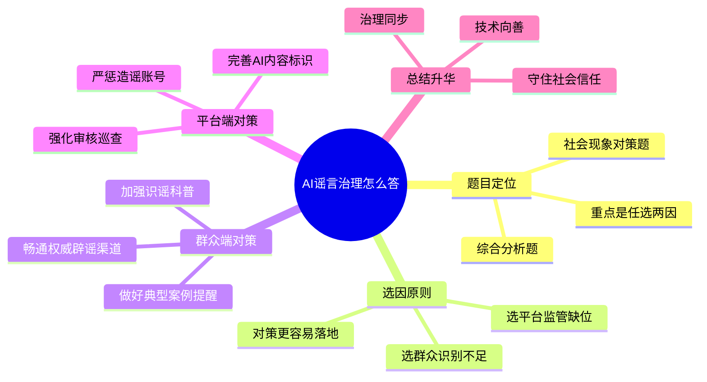

# 2026-04-05 每日一道结构化面试真题

## 1. 题目来源

说明：结构化面试真题通常不会由招录单位完整公开发布，以下内容按公开可检索页面交叉核验整理；页面均标注为“面试题”或“考生回忆版”，不属于机构模拟题。

- 来源 1：[公务员事业单位最新题库：2025年2月25日上午北京市东城区公务员面试题](https://www.gwysydw.com/ms/dqgwy/news_251328.html)
- 来源 2：[面试杜帮：2025年2月25日上午北京市东城区公务员面试题](https://blog.sina.com.cn/s/blog_7b65d40f010303a9.html)
- 来源 3：[北京金标尺京考面试试题汇总页（列有同题标题并链接到题目页）](https://beijing.m.jinbiaochi.com/bjgwy/column_2051/)

## 2. 考试时间

2025 年 2 月 25 日 上午  
北京市公务员面试 东城区

## 3. 题目

AI 技术给人们带来了很多便利，但也有一些不法分子利用 AI 合成技术编造虚假信息，炮制网络谣言。出现这种状况，有以下三个原因：

1. AI 视频逼真，容易让人相信。
2. 群众辨别意识和辨别能力不高。
3. 平台推波助澜，缺少监管。

请你针对其中的两个原因，提出解决对策。

## 4. 解题思路

### 4.1 审题拆解

这是一道典型的综合分析题里的社会现象对策题，主题是 AI 谣言治理。题目不是让考生泛泛而谈“技术双刃剑”，而是要求从给定原因中任选两个，围绕“问题为什么发生、政府和平台该怎么治、群众能力怎么补”提出针对性措施。答题时既要体现对新技术风险的敏感度，也要体现依法治理、协同治理和源头治理意识。

1. 题干关键词是“AI 合成技术”“网络谣言”“针对其中两个原因”“提出解决对策”，说明核心任务是选点作答、对策落地，而不是三点平均铺开。
2. 这道题本质上考查数字治理能力，答题时要避免把责任都推给技术本身，而要强调技术发展与治理规则同步完善。
3. 从作答完整性看，优先选择“群众辨别能力不高”和“平台监管缺位”两个角度，更容易提出政府可操作、平台可落实、社会可参与的具体措施。
4. 结尾要回到治理目标，强调既要鼓励 AI 向善发展，又要守住网络清朗空间和社会信任底线。

### 4.2 作答框架

建议按“五步法”展开：

1. 破题表态：指出 AI 谣言问题不是技术本身的问题，而是技术应用、公众识别和平台治理之间出现了脱节。
2. 选定角度：明确选择“群众辨别意识和辨别能力不高”与“平台监管不足”两个原因展开作答。
3. 分别施策：针对群众端提出科普宣传、识谣训练、权威辟谣等措施，针对平台端提出审核标识、算法压减、账号惩戒等措施。
4. 强化协同：补充网信部门、公安机关、主流媒体、平台企业和公众之间的联动治理机制。
5. 总结升华：强调在发展人工智能的同时，要以法治思维和系统思维守住网络空间秩序。

### 4.3 思维导图

### 4.4 可以参考的答题模板

各位考官，我认为，AI 谣言问题表面上是技术带来的新风险，实质上反映出公众识别能力、平台治理责任和监管协同机制还没有完全跟上。对此，不能因噎废食否定 AI 技术本身，而应坚持发展和治理并重。我选择从群众辨别能力不足和平台监管不到位两个方面谈对策，通过提升公众识谣能力、压实平台主体责任，尽量把风险化解在传播前端。

## 5. 参考答案

各位考官，我认为，AI 技术本身是推动社会进步的重要工具，给生产生活带来了很大便利，但如果被不法分子滥用，也会放大谣言传播的危害。题目给了三个原因，我选择从“群众辨别意识和辨别能力不高”以及“平台监管不足”两个方面来谈对策。因为这两个方面既是当前问题高发的关键环节，也是政府和社会最有条件发力的重点领域。

针对群众辨别能力不足的问题，关键是把“不会辨”“懒得辨”变成“愿意辨”“辨得出”。一方面，要加强常态化科普宣传，依托社区、学校、政务新媒体普及 AI 合成内容识别方法，比如看口型是否自然、画面细节是否失真、信息来源是否权威等，让群众掌握基本识谣技巧。另一方面，要完善权威辟谣机制，对网上热传信息做到快速核查、及时回应、集中发布，避免谣言抢跑、真相滞后。同时，还可以结合典型案例开展警示教育，尤其是对老年群体、未成年人等易受骗人群开展精准提醒，提高全社会的媒介素养和防骗意识。

针对平台监管缺位的问题，关键是压实平台主体责任，把技术治理真正嵌入传播链条。第一，平台要完善 AI 生成内容标识机制，对明显经过合成处理的视频、图片和音频设置醒目标注，降低误导风险。第二，要优化审核和推荐规则，对涉及公共安全、社会热点、突发事件等敏感内容提高审核等级，防止靠流量机制把谣言越推越广。第三，要建立分级惩戒机制，对恶意造谣、反复传播谣言的账号采取限流、封禁、纳入黑名单等措施，并与公安、网信等部门形成联动，让违法者付出应有代价。只有让平台从“流量优先”转向“责任优先”，才能有效压缩 AI 谣言的传播空间。

此外，在具体治理中还要形成多方协同。政府部门要完善相关规范标准，主流媒体要加强权威发声，平台企业要强化技术防控，公众个人也要做到不轻信、不转发、先核实。总的来说，面对 AI 谣言，既不能一禁了之，也不能放任不管，而是要坚持技术发展和治理规范同步推进，让人工智能真正服务社会、造福群众，而不是侵蚀公共信任、扰乱网络秩序。

## 6. 录制的口播稿

> PPT 共 8 页，翻页点用 **【→ 翻页】** 标注。

---

**【第 1 页 · 封面】**

今天这道题，来自 2025 年 2 月 25 日上午北京市公务员面试东城区场次。我这次交叉核对了公务员事业单位最新题库、面试杜帮新浪博客，以及北京金标尺的京考面试试题汇总页。这几处公开页面都把内容标注为面试题或者考生回忆版，所以这次整理的是公开可检索的真题回忆内容，不是机构模拟题。

**【→ 翻页】**

---

**【第 2 页 · 题目】**

我们先看题目。题目说，AI 技术给人们带来了很多便利，但也有一些不法分子利用 AI 合成技术编造虚假信息、炮制网络谣言。随后给出三个原因：第一，AI 视频逼真，容易让人相信；第二，群众辨别意识和辨别能力不高；第三，平台推波助澜，缺少监管。最后要求我们针对其中两个原因提出解决对策。

这道题看上去在谈网络热点，实际上考查的是考生的数字治理意识、问题分析能力和提出可操作对策的能力。也就是说，不能停留在泛泛批评 AI 有风险，而要有针对性地选出两个原因，给出能真正落地的治理办法。

**【→ 翻页】**

---

**【第 3 页 · 审题拆解】**

审题时重点抓四层。第一，这是一道综合分析题里的社会现象对策题，主题是 AI 谣言治理。第二，题目明确要求针对三个原因中的两个原因作答，所以不能三点平均用力，而要有取舍。第三，从答题效果看，选择“群众辨别能力不足”和“平台监管缺位”更容易展开，因为这两个角度都能提出比较具体的治理举措。第四，结尾要回到治理目标，说明既要促进 AI 向善发展，也要守住网络清朗空间和社会信任底线。

**【→ 翻页】**

---

**【第 4 页 · 作答框架·五步法】**

这道题可以按五步法来答。第一步，破题表态，指出 AI 谣言不是技术本身的问题，而是技术应用、公众识别和平台治理之间出现了脱节。第二步，选定角度，明确选择群众辨别能力不足和平台监管不足两个原因。第三步，分别施策，群众端强调识谣科普、案例提醒和权威辟谣，平台端强调内容标识、审核巡查和账号惩戒。第四步，强化协同，补充网信、公安、媒体、平台和公众的联动治理。第五步，总结升华，强调技术发展和治理规范要同步推进。

这里也可以直接套用一个答题模板。比如开头可以这样说：我认为，AI 谣言问题表面上是技术带来的新风险，实质上反映出公众识别能力、平台治理责任和监管协同机制还没有完全跟上，因此要坚持发展和治理并重，选准关键环节精准施策。

**【→ 翻页】**

---

**【第 5 页 · 思维导图】**

如果把这道题画成思维导图，中间就是“AI 谣言治理怎么答”。第一部分是题目定位，说明它是一道综合分析题，也是社会现象对策题，重点是任选两因作答。第二部分是选因原则，建议选群众识别不足和平台监管缺位，因为更容易提出具体措施。第三部分是群众端对策，包括加强识谣科普、做好典型案例提醒、畅通权威辟谣渠道。第四部分是平台端对策，包括完善 AI 内容标识、强化审核巡查、严惩造谣账号。最后再升华一句，就是技术向善、治理同步、守住社会信任。

好，以上就是这道题的来源、考试时间、题目和解题思路。下面是参考答案。

**【→ 翻页】**

---

**【第 6 页 · 参考答案 1/2】**

各位考官，我认为，AI 技术本身是推动社会进步的重要工具，给生产生活带来了很大便利，但如果被不法分子滥用，也会放大谣言传播的危害。题目给了三个原因，我选择从群众辨别意识和辨别能力不高，以及平台监管不足两个方面来谈对策。因为这两个方面既是当前问题高发的关键环节，也是政府和社会最有条件发力的重点领域。

针对群众辨别能力不足的问题，关键是把不会辨、懒得辨，变成愿意辨、辨得出。一方面，要加强常态化科普宣传，依托社区、学校、政务新媒体普及 AI 合成内容识别方法，比如看口型是否自然、画面细节是否失真、信息来源是否权威等，让群众掌握基本识谣技巧。另一方面，要完善权威辟谣机制，对网上热传信息做到快速核查、及时回应、集中发布，避免谣言抢跑、真相滞后。

**【→ 翻页】**

---

**【第 7 页 · 参考答案 2/2】**

同时，还要结合典型案例开展警示教育，尤其是对老年群体、未成年人等易受骗人群开展精准提醒，提高全社会的媒介素养和防骗意识。针对平台监管缺位的问题，关键是压实平台主体责任，把技术治理真正嵌入传播链条。平台要完善 AI 生成内容标识机制，对明显经过合成处理的视频、图片和音频设置醒目标注；要优化审核和推荐规则，对涉及公共安全、社会热点、突发事件等敏感内容提高审核等级；还要建立分级惩戒机制，对恶意造谣、反复传播谣言的账号采取限流、封禁、黑名单等措施，并与公安、网信等部门形成联动。

总的来说，面对 AI 谣言，既不能一禁了之，也不能放任不管，而是要坚持技术发展和治理规范同步推进，让人工智能真正服务社会、造福群众，而不是侵蚀公共信任、扰乱网络秩序。

**【→ 翻页】**

---

**【第 8 页 · CTA】**

好，以上就是今天的每日一道结构化面试真题。觉得有用的话，点赞、收藏、关注，我们明天继续。
