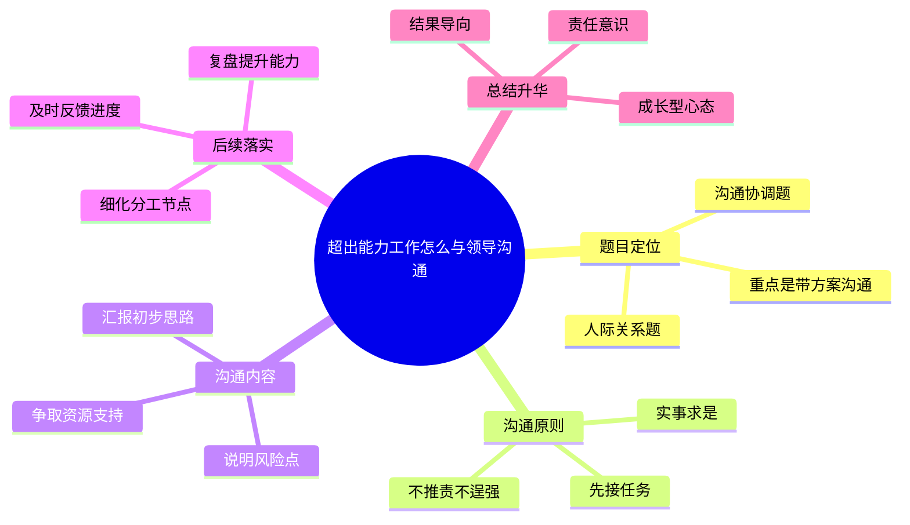

# 2026-04-06 每日一道结构化面试真题

## 1. 题目来源

说明：结构化面试真题通常不会由招录单位完整公开发布，以下内容按公开可检索页面交叉核验整理；题目页面均明确标注为“面试题”或“考生回忆版”，不属于机构模拟题。官方公告用于核验考试时间与考试名称。

- 来源 1：[2025年6月21日上午山西省考补录公务员面试题](https://www.gwysydw.com/ms/dqgwy/news_253422.html)
- 来源 2：[2025年6月21日山西省考补录面试题(考生回忆版）](https://weihai.lgwy.net/html/m/m_132905.html)
- 来源 3：[山西省2025年度考试录用公务员补充录用面试公告](https://www.lvliang.gov.cn/llxxgk/zfxxgk/xxgkml/zdlygk/jy_59171/rsgz_21549/202506/t20250611_1957492.html)

## 2. 考试时间

2025 年 6 月 21 日 上午  
山西省2025年度考试录用公务员补充录用面试

## 3. 题目

领导给你安排了一项超出你能力范围的工作，你自己无法单独完成，这时你该怎样与领导沟通。

## 4. 解题思路

### 4.1 审题拆解

这是一道典型的人际关系与沟通协调题。题目表面在问“怎么和领导说”，实质上考查考生面对压力任务时，是否具备正确的态度、清晰的汇报能力和解决问题意识。答题时既不能一上来就说“我做不了”，显得畏难推责；也不能硬着头皮把问题藏着掖着，导致工作延误。最稳妥的处理方式，是先接任务、再讲困难、同时带着方案去沟通，体现出对工作的负责和对领导的尊重。

1. 题干关键词是“超出能力范围”“无法单独完成”“怎样与领导沟通”，说明重点不是抱怨困难，而是通过有效沟通推动任务落地。
2. 这道题的核心矛盾，是任务要求与个人现有能力、资源之间存在差距，所以作答时要突出“主动补位、寻求支持、保障结果”。
3. 沟通时要注意方式方法，既要如实汇报客观困难，也要提出自己初步思考，避免把问题原封不动甩给领导。
4. 结尾要回到结果导向，说明后续会根据领导意见细化方案、按节点推进，并把这次任务作为提升能力的机会。

### 4.2 作答框架

建议按“五步法”展开：

1. 先表态接任务：感谢领导信任，明确自己愿意承担任务、不回避困难。
2. 再客观说困难：围绕经验不足、专业短板或资源限制，简明说明当前单独完成的风险点。
3. 主动提初步方案：把自己已经想到的推进思路、可分解步骤和备选做法先汇报出来。
4. 请求必要支持：结合任务需要，请领导明确重点、协调资源，或安排有经验同事协同配合。
5. 会后抓落实：按照沟通结果立刻行动，及时复盘总结，把短板转化为成长空间。

### 4.3 思维导图

### 4.4 可以参考的答题模板

各位考官，面对领导交办的超纲任务，我不会因为有困难就退缩，也不会因为怕丢面子就隐瞒问题，而是会坚持对工作负责、对领导负责、对结果负责的原则，主动带着思路去沟通，既把困难讲清楚，也把解决办法提出来，争取在领导指导和团队协作下把任务高质量完成。

## 5. 参考答案

各位考官，遇到这种情况，我会本着对工作负责的态度，既不盲目逞强，也不消极推脱，而是及时、坦诚、建设性地与领导沟通，确保任务最终能够顺利完成。具体来说，我会从“先接任务、再讲困难、带着方案去汇报”三个层面来处理。

首先，我会第一时间表明态度，感谢领导对我的信任，并明确表示自己愿意承担这项任务。因为领导把任务交给我，本身就是一种锻炼和信任。如果一上来就说“我干不了”，容易给领导留下畏难情绪重、缺乏担当的印象。所以我会先把责任接住，再尽快梳理任务目标、完成时限、重点难点和成果要求，确保自己对任务边界有准确理解。

其次，在和领导沟通时，我会客观说明当前确实存在的困难，但重点不放在“我不会”，而放在“如果单独推进，哪些环节可能影响进度和质量”。比如，我会向领导说明自己目前在哪些方面经验不足、哪些专业内容还不熟悉、哪些资源暂时无法独立协调，同时把我已经做过的准备和形成的初步思路一并汇报。比如可以向领导请示：这项工作我愿意全力推进，目前我初步考虑可以分为前期调研、方案起草和组织实施三个步骤，但在专业把关和部门协同上还需要进一步支持，想请您帮我明确一下重点方向，或者协调一位经验更丰富的同事一起参与。这样沟通，既体现了尊重领导，也体现了我是在想办法解决问题，而不是把问题推回去。

最后，沟通之后我会按照领导的意见迅速落实。如果领导明确了重点，我就马上细化工作计划，列出时间表和责任分工；如果领导协调了同事或资源，我会主动对接、加强学习、边干边补短板。在推进过程中，我还会注意定期向领导反馈进度，对关键节点、突出问题和阶段成果及时汇报，避免信息不对称影响整体安排。任务完成后，我也会认真复盘，看看自己短板到底在哪里，是专业知识不足、统筹协调不够，还是经验储备不够，并有针对性地学习提升。总之，面对超出能力范围的任务，最重要的不是回避，而是以负责的态度、务实的沟通和积极的行动，把压力转化成成长，把任务真正落到实处。

## 6. 录制的口播稿

> PPT 共 8 页，翻页点用 **【→ 翻页】** 标注。

---

**【第 1 页 · 封面】**

今天这道题，来自 2025 年 6 月 21 日上午山西省考补录公务员面试。我这次交叉核对了公务员事业单位最新题库、联创世华的考生回忆版页面，同时又用山西省公务员补充录用面试公告核验了考试时间和考试名称。也就是说，这次整理依据的是公开可检索的真题回忆内容，不是机构模拟题。

**【→ 翻页】**

---

**【第 2 页 · 题目】**

我们先看题目。题目是，领导给你安排了一项超出你能力范围的工作，你自己无法单独完成，这时你该怎样与领导沟通。

这道题很短，但很典型。它看起来在问沟通技巧，实际上是在考查考生遇到压力任务时，有没有担当意识、有没有汇报能力、有没有解决问题的思路。答得不好，容易变成一味诉苦；答得好，就能体现出既尊重领导、又对结果负责的职业素养。

**【→ 翻页】**

---

**【第 3 页 · 审题拆解】**

审题时重点抓四层。第一，这是一道人际关系题，也是沟通协调题，重点不是“能不能做”，而是“怎么通过沟通把事办成”。第二，题干里的关键信息是“超出能力范围”和“无法单独完成”，说明客观上确实有困难，所以不能硬扛到底。第三，沟通时既要实事求是，又不能把问题原封不动甩给领导，而是要把风险点和初步方案一起报上去。第四，结尾一定要回到结果导向，说明自己会根据领导意见抓紧落实，并把这次任务当成提升能力的机会。

**【→ 翻页】**

---

**【第 4 页 · 作答框架·五步法】**

这道题可以按五步法来答。第一步，先表态接任务，说明自己愿意承担，不回避困难。第二步，再客观说困难，简明汇报经验不足、专业短板或者资源限制。第三步，主动提初步方案，把自己已经想到的推进思路和备选做法先讲出来。第四步，请求必要支持，请领导明确重点、协调资源或者安排有经验的同事协同。第五步，会后抓落实，按照沟通结果马上推进，并在过程中及时反馈。

这里也可以直接套一个答题模板。比如开头可以这样说：面对领导交办的超纲任务，我不会因为有困难就退缩，也不会因为怕出错就隐瞒问题，而是会坚持对工作负责、对领导负责、对结果负责的原则，主动带着思路去沟通，争取在指导和协作下高质量完成任务。

**【→ 翻页】**

---

**【第 5 页 · 思维导图】**

如果把这道题画成思维导图，中间就是“超出能力工作怎么与领导沟通”。第一部分是题目定位，说明它是一道人际关系题和沟通协调题，重点是带着方案去沟通。第二部分是沟通原则，包括先接任务、实事求是、不推责不逞强。第三部分是沟通内容，也就是说明风险点、汇报初步思路、争取资源支持。第四部分是后续落实，包括细化分工节点、及时反馈进度、复盘提升能力。最后再升华一句，就是坚持结果导向、责任意识和成长型心态。

好，以上就是这道题的来源、考试时间、题目和解题思路。下面是参考答案。

**【→ 翻页】**

---

**【第 6 页 · 参考答案 1/2】**

各位考官，遇到这种情况，我会本着对工作负责的态度，既不盲目逞强，也不消极推脱，而是及时、坦诚、建设性地与领导沟通，确保任务最终能够顺利完成。具体来说，我会从先接任务、再讲困难、带着方案去汇报三个层面来处理。

首先，我会第一时间表明态度，感谢领导对我的信任，并明确表示自己愿意承担这项任务。因为领导把任务交给我，本身就是一种锻炼和信任。如果一上来就说我干不了，容易给领导留下畏难情绪重、缺乏担当的印象。所以我会先把责任接住，再尽快梳理任务目标、完成时限、重点难点和成果要求，确保自己对任务边界有准确理解。

**【→ 翻页】**

---

**【第 7 页 · 参考答案 2/2】**

其次，在和领导沟通时，我会客观说明当前确实存在的困难，但重点不放在我不会，而放在如果单独推进，哪些环节可能影响进度和质量。比如，我会说明自己目前在哪些方面经验不足、哪些专业内容还不熟悉、哪些资源暂时无法独立协调，同时把我已经做过的准备和形成的初步思路一并汇报，请领导帮助明确重点方向，或者协调有经验的同事一起参与。这样沟通，既体现了尊重领导，也体现了我是在想办法解决问题，而不是把问题推回去。

最后，沟通之后我会按照领导的意见迅速落实。如果领导明确了重点，我就马上细化工作计划，列出时间表和责任分工；如果领导协调了同事或资源，我会主动对接、加强学习、边干边补短板。在推进过程中，我还会定期向领导反馈进度，对关键节点、突出问题和阶段成果及时汇报。任务完成后，我也会认真复盘，有针对性地补齐短板。总之，面对超出能力范围的任务，最重要的不是回避，而是以负责的态度、务实的沟通和积极的行动，把压力转化成成长，把任务真正落到实处。

**【→ 翻页】**

---

**【第 8 页 · CTA】**

好，以上就是今天的每日一道结构化面试真题。觉得有用的话，点赞、收藏、关注，我们明天继续。
