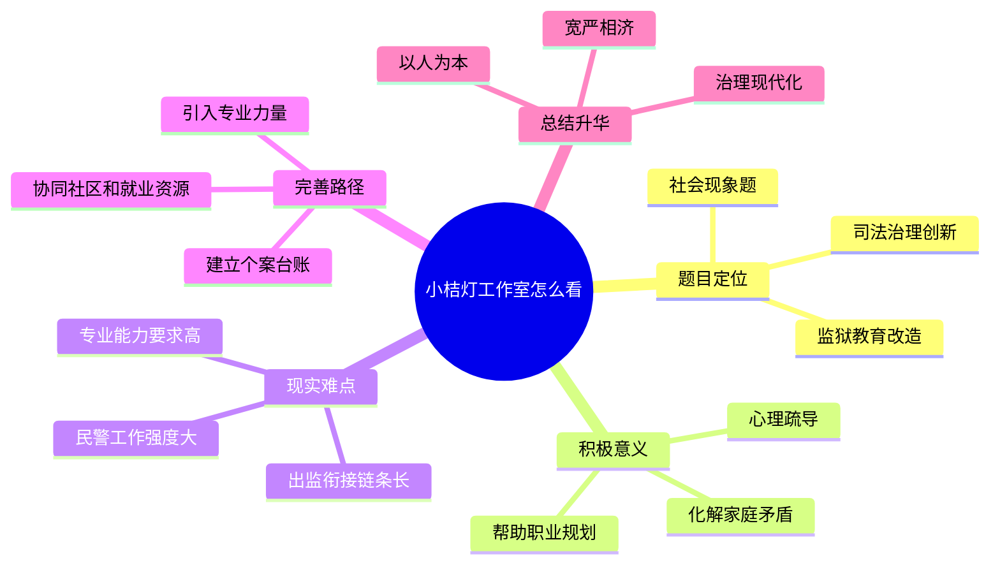

# 2026-04-07 每日一道结构化面试真题

## 1. 题目来源

说明：结构化面试真题通常不会由招录单位完整公开发布，以下内容按公开可检索页面交叉核验整理；题目页面均明确标注为“面试题”或“考生回忆版”，不属于机构模拟题。官方公告用于核验考试时间与考试名称。公开题源未附标准答案，本文参考答案为非官方参考作答。

- 来源 1：[2025年6月21日下午山西省考补录公务员面试题](https://www.gwysydw.com/ms/dqgwy/news_253423.html)
- 来源 2：[2025年6月21日山西省考补录面试题(考生回忆版）](https://sd.lgwy.net/news/index/news_info/id/132905.html)
- 来源 3：[山西省2025年度考试录用公务员补充录用面试公告](https://www.lvliang.gov.cn/llxxgk/zfxxgk/xxgkml/zdlygk/jy_59171/rsgz_21549/202506/t20250611_1957492.html)

## 2. 考试时间

2025 年 6 月 21 日 下午  
山西省2025年度考试录用公务员补充录用面试

## 3. 题目

江苏省新增了“小桔灯”民警工作室、调解室，主要面对服刑人员，帮他们解决心理问题，帮助他们职业规划、家庭矛盾，工作强度大，工作效果好，你怎么看？

## 4. 解题思路

### 4.1 审题拆解

这是一道典型的社会现象类综合分析题，背景落在监狱治理和教育改造工作上。题目没有让我们批评“小桔灯”，而是给出了“工作强度大、工作效果好”的评价，所以作答重点应当放在肯定创新价值、分析现实难点、提出长效完善建议上。答题时要避免只讲温情，也要看到基层民警压力、专业能力供给、部门协同和制度化保障等问题。

1. 题干关键词是“小桔灯民警工作室、调解室”“服刑人员”“心理问题、职业规划、家庭矛盾”，说明它是司法行政系统的治理创新。
2. “工作强度大、工作效果好”提示答题不能停留在赞美，而要分析好效果背后的投入成本和可持续问题。
3. 服刑人员改造不是单一管理问题，还牵涉心理疏导、家庭支持、就业回归和社会融入，适合从系统治理角度展开。
4. 结尾要回到治理现代化，说明既要让“小桔灯”照亮回归路，也要用制度、专业和资源保障一线民警长期干得好。

### 4.2 作答框架

建议按“五步法”展开：

1. 明确态度：肯定“小桔灯”是教育改造和柔性治理的有益探索。
2. 分析意义：从服刑人员心理修复、家庭关系修复、职业规划和降低再犯风险展开。
3. 点出难点：指出工作强度大、专业要求高、民警压力重、社会资源衔接不足等现实问题。
4. 提出对策：从专业队伍、部门协同、数字台账、社会力量参与和长效激励等方面完善。
5. 总结升华：落到以人为本、宽严相济和基层治理现代化，强调可复制但不能简单加码。

### 4.3 思维导图

### 4.4 可以参考的答题模板

各位考官，对于题干中的“小桔灯”民警工作室，我认为这不是简单增加一个工作牌子，而是监狱治理从单纯管控向教育矫治、心理支持和社会回归延伸的一种积极探索。我们既要看到它对服刑人员改造和社会安全的积极意义，也要看到一线民警工作强度大、专业要求高的问题，通过制度化、专业化、协同化的方式，让这盏“小桔灯”真正持续照亮服刑人员改造和回归社会的道路。

## 5. 参考答案（公开题源未附标准答案，以下为非官方参考作答）

各位考官，对于江苏省新增“小桔灯”民警工作室、调解室这一做法，我总体上是支持和肯定的。它说明监狱管理工作不是简单地看住人、管住人，而是在依法管理的基础上，更加重视教育改造、心理疏导和社会回归，这体现了以人为本、宽严相济的治理理念。

首先，“小桔灯”的积极意义很明显。对服刑人员来说，他们在服刑期间可能面临心理压力、家庭关系破裂、未来就业迷茫等问题。如果这些问题长期得不到疏导，既会影响日常改造秩序，也会影响刑满释放后的社会融入。民警工作室和调解室能够通过谈心谈话、心理疏导、家庭矛盾调解、职业规划帮助等方式，把问题解决在萌芽阶段，帮助服刑人员重新建立责任意识和生活信心。从更长远看，这也有利于降低再犯风险，维护社会稳定。

其次，题干中也提到这项工作“工作强度大”。这提醒我们，好的基层创新不能只靠一线民警的责任心长期硬扛。心理疏导、矛盾调解、职业规划都具有较强专业性，如果缺少制度保障和资源支撑，容易出现民警压力过大、工作标准不统一、个案跟踪不连续等问题。因此，对这项做法既要肯定，也要从长效机制上继续完善。

具体来说，可以从几个方面发力。第一，加强专业支撑，建立民警、心理咨询师、社工、法律援助人员共同参与的工作机制，让专业的人做专业的事。第二，完善个案台账，对服刑人员的心理状态、家庭矛盾、技能特长和就业意向进行动态记录，做到一人一策、精准帮扶。第三，加强与司法所、社区、民政、人社等部门衔接，把监内教育改造和出监后的安置帮教、就业服务连接起来。第四，也要关心一线民警，通过培训、轮岗、心理减压和激励保障，避免把治理创新简单变成基层加码。

总之，“小桔灯”虽小，但照见的是基层治理的大方向。它启示我们，真正有效的监管改造，不仅要有法律的刚性，也要有教育的温度、专业的支撑和制度的保障。只有把这些环节贯通起来，才能让服刑人员更好改造、顺利回归，也让社会治理更有韧性、更有温度。

## 6. 录制的口播稿

> PPT 共 8 页，翻页点用 **【→ 翻页】** 标注。

---

**【第 1 页 · 封面】**

今天这道题，来自 2025 年 6 月 21 日下午山西省考补录公务员面试。我这次交叉核对了公务员事业单位最新题库和联创世华的考生回忆版页面，两个页面都明确标注为面试题或考生回忆版；同时又用山西省 2025 年度考试录用公务员补充录用面试公告，核验了考试名称和考试时间。公开题源没有附标准答案，所以今天给大家的是非官方参考作答。

**【→ 翻页】**

---

**【第 2 页 · 题目】**

我们先看题目。题目是，江苏省新增了“小桔灯”民警工作室、调解室，主要面对服刑人员，帮他们解决心理问题，帮助他们职业规划、家庭矛盾，工作强度大，工作效果好，你怎么看？

这道题是一道社会现象类综合分析题，背景落在监狱治理和教育改造工作上。题目已经给出了“工作效果好”的倾向，所以答题时不能为了辩证而硬批评，而是要在肯定价值的基础上，分析它为什么有效、难点在哪里、后续怎么更好地长效运行。

**【→ 翻页】**

---

**【第 3 页 · 审题拆解】**

审题时重点抓四层。第一，“小桔灯民警工作室、调解室”说明这是司法行政系统里的治理创新。第二，服务对象是服刑人员，服务内容包括心理问题、职业规划和家庭矛盾，所以不能只从日常管理角度看，还要看到教育矫治和社会回归。第三，题干说工作强度大、工作效果好，提示我们既要肯定一线工作成效，也要看到基层民警长期承压的问题。第四，最后要回到治理现代化，说明要通过制度、专业和协同来保障好做法持续发挥作用。

**【→ 翻页】**

---

**【第 4 页 · 作答框架·五步法】**

这道题可以按五步法来答。第一步，明确态度，肯定“小桔灯”是教育改造和柔性治理的有益探索。第二步，分析意义，可以从服刑人员心理修复、家庭关系修复、职业规划和降低再犯风险来展开。第三步，点出难点，比如工作强度大、专业要求高、民警压力重、社会资源衔接不足。第四步，提出对策，包括专业队伍、部门协同、数字台账、社会力量参与和长效激励。第五步，总结升华，落到以人为本、宽严相济和基层治理现代化。

这里也可以直接套一个答题模板。比如开头可以这样说：对于题干中的“小桔灯”民警工作室，我认为这不是简单增加一个工作牌子，而是监狱治理从单纯管控向教育矫治、心理支持和社会回归延伸的一种积极探索。我们既要看到它对服刑人员改造和社会安全的积极意义，也要看到一线民警工作强度大、专业要求高的问题。

**【→ 翻页】**

---

**【第 5 页 · 思维导图】**

如果把这道题画成思维导图，中间就是“小桔灯工作室怎么看”。第一部分是题目定位，它是社会现象题、司法治理创新题，也是监狱教育改造题。第二部分是积极意义，包括心理疏导、化解家庭矛盾、帮助职业规划。第三部分是现实难点，包括民警工作强度大、专业能力要求高、出监衔接链条长。第四部分是完善路径，包括引入专业力量、建立个案台账、协同社区和就业资源。最后再升华一句，就是坚持以人为本、宽严相济和治理现代化。

好，以上就是这道题的来源、考试时间、题目和解题思路。下面是参考答案。

**【→ 翻页】**

---

**【第 6 页 · 参考答案 1/2】**

各位考官，对于江苏省新增“小桔灯”民警工作室、调解室这一做法，我总体上是支持和肯定的。它说明监狱管理工作不是简单地看住人、管住人，而是在依法管理的基础上，更加重视教育改造、心理疏导和社会回归，这体现了以人为本、宽严相济的治理理念。

首先，“小桔灯”的积极意义很明显。对服刑人员来说，他们在服刑期间可能面临心理压力、家庭关系破裂、未来就业迷茫等问题。如果这些问题长期得不到疏导，既会影响日常改造秩序，也会影响刑满释放后的社会融入。民警工作室和调解室能够通过谈心谈话、心理疏导、家庭矛盾调解、职业规划帮助等方式，把问题解决在萌芽阶段，帮助服刑人员重新建立责任意识和生活信心。从更长远看，这也有利于降低再犯风险，维护社会稳定。

**【→ 翻页】**

---

**【第 7 页 · 参考答案 2/2】**

其次，题干中也提到这项工作“工作强度大”。这提醒我们，好的基层创新不能只靠一线民警的责任心长期硬扛。心理疏导、矛盾调解、职业规划都具有较强专业性，如果缺少制度保障和资源支撑，容易出现民警压力过大、工作标准不统一、个案跟踪不连续等问题。因此，对这项做法既要肯定，也要从长效机制上继续完善。

具体来说，可以从几个方面发力。第一，加强专业支撑，建立民警、心理咨询师、社工、法律援助人员共同参与的工作机制。第二，完善个案台账，对服刑人员的心理状态、家庭矛盾、技能特长和就业意向进行动态记录。第三，加强与司法所、社区、民政、人社等部门衔接，把监内教育改造和出监后的安置帮教、就业服务连接起来。第四，也要关心一线民警，通过培训、轮岗、心理减压和激励保障，避免把治理创新简单变成基层加码。

总之，“小桔灯”虽小，但照见的是基层治理的大方向。它启示我们，真正有效的监管改造，不仅要有法律的刚性，也要有教育的温度、专业的支撑和制度的保障。只有把这些环节贯通起来，才能让服刑人员更好改造、顺利回归，也让社会治理更有韧性、更有温度。

**【→ 翻页】**

---

**【第 8 页 · CTA】**

好，以上就是今天的每日一道结构化面试真题。觉得有用的话，点赞、收藏、关注，我们明天继续。
