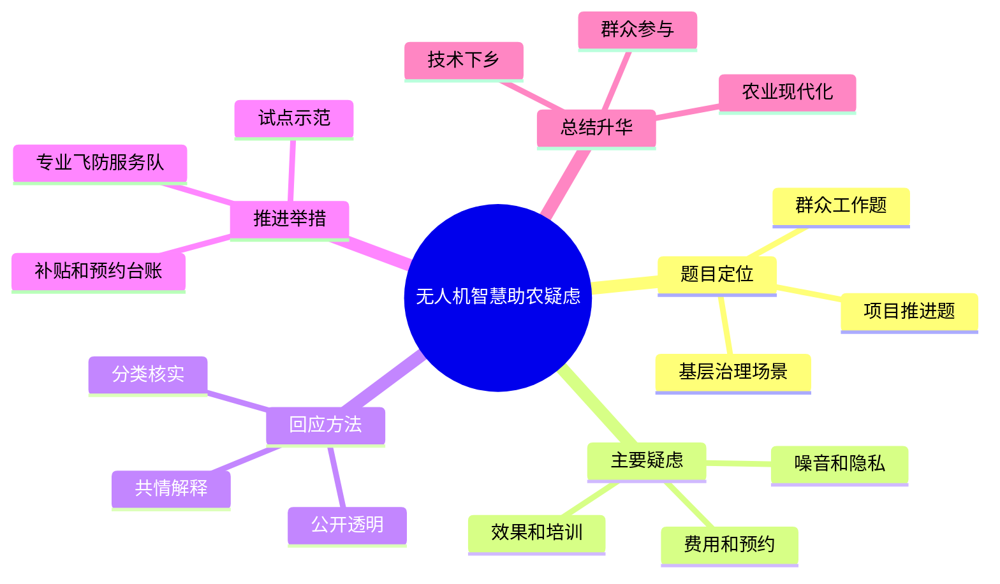

# 2026-04-08 每日一道结构化面试真题

## 1. 题目来源

说明：结构化面试真题通常不会由招录单位完整公开发布，以下内容按公开可检索页面交叉核验整理；题目页面明确标注为“面试题”或“考生回忆”，不属于机构模拟题。官方公告用于核验考试时间与考试名称。公开题源未附标准答案，本文参考答案为非官方参考作答。

- 来源 1：[2025年2月22日浙江省考公务员面试题（B类基层岗）](https://gwysydw.com/ms/dqgwy/news_251268.html)
- 来源 2：[面试考情｜2026年浙江省公务员面试考情（含2025年面试真题回顾）](https://www.sohu.com/a/973564484_121123700)
- 来源 3：[2025浙江省考试录用公务员笔试成绩于今日15时起查询 2月22日-23日面试](https://sd.lgwy.net/html/m/m_130089.html)

## 2. 考试时间

2025 年 2 月 22 日  
浙江省 2025 年考试录用公务员面试 B 类基层岗

## 3. 题目

关于无人机智慧助农。

农民 A：我觉得不理解，觉得无人机很吵，甚至感觉无人机还在监视我。

农民 B：我觉得无人机太贵了，也不好预约工作的时间，另外觉得无人机在进行播撒的时候，农药撒出去后还得自己人工再翻一下土。

农民 C：我觉得这个东西太难了，也没有人对我们进行培训。

如果你是该县的工作人员，对于上述问题，你会怎么办？

## 4. 解题思路

### 4.1 审题拆解

这是一道基层治理场景下的群众工作与应急应变复合题。题目不是让我们简单宣传无人机有多先进，而是要求站在县级工作人员的岗位上，回应村民对噪音隐私、成本预约、作业效果、操作培训等方面的具体顾虑。作答重点应放在先共情解释、再分类核实、再试点优化、最后建立长效机制，避免一上来就用行政命令推进项目。

1. 题干关键词是“无人机智慧助农”“村民意见不一”“项目负责人”，说明要兼顾技术推广和群众接受度。
2. 农民 A 的担忧集中在噪音和被监视感，本质是信息不透明和安全边界不清。
3. 农民 B 的担忧集中在价格、预约和喷洒效果，本质是成本收益和服务质量问题。
4. 农民 C 的担忧集中在不会用、没人培训，本质是技术门槛和配套服务不足。
5. 答题要体现基层工作方法：先听民意、再做解释、再用试点和数据证明效果，最后用培训、补贴、服务队和监管制度保障落地。

### 4.2 作答框架

建议按“五步法”展开：

1. 表明态度：智慧助农方向值得肯定，但必须尊重村民感受，不能简单硬推。
2. 现场沟通：召开院坝会、入户走访，逐条记录 A、B、C 三类疑虑，说明无人机作业边界和数据用途。
3. 分类解决：对噪音隐私、费用预约、喷洒效果、培训操作分别给出具体办法。
4. 试点验证：选择自愿农户和典型地块先试飞、测效果、算成本，用看得见的数据打消顾虑。
5. 长效完善：建立飞防服务队、预约台账、补贴机制、培训机制和反馈渠道，让智慧助农真正服务农业生产。

### 4.3 思维导图

### 4.4 可以参考的答题模板

各位考官，如果我是该项目负责人，面对村民对无人机智慧助农的疑虑，我不会简单认为群众不理解新技术，更不会用行政命令强行推进。智慧助农的出发点是提高农业生产效率，但能不能真正落地，关键要看群众是否听得懂、算得清、信得过、用得上。因此，我会坚持问题导向和群众路线，先把顾虑收集清楚，再把服务方案优化到位，用试点效果和长效机制推动项目稳妥实施。

## 5. 参考答案（公开题源未附标准答案，以下为非官方参考作答）

各位考官，如果我是该县工作人员，面对村民对无人机智慧助农项目的疑虑，我会先稳住节奏、充分沟通，而不是简单地把群众意见看成对新技术的抵触。无人机助农的方向值得肯定，但基层项目要真正落地，必须让群众明白它有什么用、怎么用、花多少钱、出现问题谁负责。

第一，我会先做好解释沟通和意见收集。可以通过村民代表会、院坝会、入户走访等方式，把农民 A、B、C 的意见逐条记录下来，并邀请农业技术人员、无人机飞手和村干部一起参加答疑。对农民 A 担心噪音和监视的问题，要说明无人机主要用于喷洒、播撒、巡田等农业作业，不采集个人隐私信息；同时公开作业时间、飞行路线和作业范围，尽量避开群众休息时间和人员密集区域，减少噪音干扰和心理顾虑。

第二，针对农民 B 反映的价格、预约和效果问题，我会把账算清楚、把服务做实。比如比较人工喷洒和无人机喷洒在时间、用药量、覆盖面积、人工成本上的差异，让群众看到是否划算。对于费用较高的问题，可以积极争取农机补贴、农业社会化服务补贴，探索村集体统一采购服务、农户按需付费的方式。对于预约不方便的问题，可以建立村级预约台账，按照农时、地块、作物类型统一排班。对于喷洒效果不放心的问题，可以先选择典型地块进行试飞示范，现场检测喷洒覆盖率和作业效果，不达标就调整参数或更换服务单位。

第三，针对农民 C 说“太难、没人培训”的问题，我会补齐培训和服务短板。可以组织几场简单实用的培训课，让农户知道怎么预约、怎么配合作业、作业前后要注意什么；同时重点培养村里的年轻农户、种植大户和农机手，组建本地飞防服务队。对普通农户来说，并不要求人人都会操作无人机，而是要让他们知道什么时候用、找谁用、出了问题怎么反馈。

第四，要建立长效保障机制。项目推进过程中，要把安全管理、服务质量、费用标准、投诉反馈都制度化，做到飞行有计划、作业有记录、效果有评估、问题有回访。对于群众反映集中的噪音、费用、效果等问题，要定期公开整改结果，避免项目一阵风。

总之，智慧助农不是把新设备搬到田里就结束了，而是要把技术、服务和群众需求真正连接起来。只有把群众顾虑回应好，把成本效果说明白，把培训服务跟上去，无人机智慧助农才能从“看起来先进”变成农民真正愿意用、用得好的现代农业工具。

## 6. 录制的口播稿

> PPT 共 8 页，翻页点用 **【→ 翻页】** 标注。

---

**【第 1 页 · 封面】**

今天这道题，来自 2025 年 2 月 22 日浙江省考公务员面试 B 类基层岗。我这次核对了公务员事业单位最新题库页面和搜狐 2025 年面试真题回顾页面，两个页面都把它归入 2025 年浙江省考面试真题；同时又用浙江省公务员局发布的面试安排信息，核验了全省公务员四级联考面试定于 2 月 22 日到 23 日举行。公开题源没有附标准答案，所以今天给大家的是非官方参考作答。

**【→ 翻页】**

---

**【第 2 页 · 题目】**

我们先看题目。题目是，关于无人机智慧助农。农民 A 说，我觉得不理解，觉得无人机很吵，甚至感觉无人机还在监视我。农民 B 说，我觉得无人机太贵了，也不好预约工作的时间，另外觉得无人机在进行播撒的时候，农药撒出去后还得自己人工再翻一下土。农民 C 说，我觉得这个东西太难了，也没有人对我们进行培训。如果你是该县的工作人员，对于上述问题，你会怎么办？

这道题不是让我们简单说无人机有多先进，而是考察基层工作人员怎么推进新项目、怎么回应群众疑虑、怎么把农业现代化和群众接受度结合起来。

**【→ 翻页】**

---

**【第 3 页 · 审题拆解】**

审题时重点抓五层。第一，关键词是无人机智慧助农、村民意见不一、项目负责人，说明这是项目推进和群众工作结合的题。第二，农民 A 的担忧是噪音和被监视感，本质是信息不透明和安全边界不清。第三，农民 B 的担忧是价格、预约和喷洒效果，本质是成本收益和服务质量问题。第四，农民 C 的担忧是不会用、没人培训，本质是技术门槛和配套服务不足。第五，答题要体现基层工作方法，先听民意，再做解释，再用试点和数据证明效果，最后用培训、补贴、服务队和监管制度保障落地。

**【→ 翻页】**

---

**【第 4 页 · 作答框架·五步法】**

这道题可以按五步法来答。第一步，表明态度，智慧助农方向值得肯定，但必须尊重村民感受，不能简单硬推。第二步，现场沟通，召开院坝会、入户走访，逐条记录三类疑虑，说明无人机作业边界和数据用途。第三步，分类解决，对噪音隐私、费用预约、喷洒效果、培训操作分别给出办法。第四步，试点验证，选择自愿农户和典型地块先试飞、测效果、算成本，用看得见的数据打消顾虑。第五步，长效完善，建立飞防服务队、预约台账、补贴机制、培训机制和反馈渠道。

这里也可以直接套一个答题模板。比如开头可以这样说：如果我是该项目负责人，面对村民对无人机智慧助农的疑虑，我不会简单认为群众不理解新技术，更不会用行政命令强行推进。智慧助农的出发点是提高农业生产效率，但能不能真正落地，关键要看群众是否听得懂、算得清、信得过、用得上。

**【→ 翻页】**

---

**【第 5 页 · 思维导图】**

如果把这道题画成思维导图，中间就是“无人机智慧助农疑虑”。第一部分是题目定位，它是群众工作题、项目推进题，也是基层治理场景题。第二部分是主要疑虑，包括噪音和隐私、费用和预约、效果和培训。第三部分是回应方法，包括共情解释、分类核实、公开透明。第四部分是推进举措，包括试点示范、专业飞防服务队、补贴和预约台账。最后再升华一句，就是坚持技术下乡、群众参与和农业现代化。

好，以上就是这道题的来源、考试时间、题目和解题思路。下面是参考答案。

**【→ 翻页】**

---

**【第 6 页 · 参考答案 1/2】**

各位考官，如果我是该县工作人员，面对村民对无人机智慧助农项目的疑虑，我会先稳住节奏、充分沟通，而不是简单地把群众意见看成对新技术的抵触。无人机助农的方向值得肯定，但基层项目要真正落地，必须让群众明白它有什么用、怎么用、花多少钱、出现问题谁负责。

第一，我会先做好解释沟通和意见收集。可以通过村民代表会、院坝会、入户走访等方式，把农民 A、B、C 的意见逐条记录下来，并邀请农业技术人员、无人机飞手和村干部一起参加答疑。对农民 A 担心噪音和监视的问题，要说明无人机主要用于喷洒、播撒、巡田等农业作业，不采集个人隐私信息；同时公开作业时间、飞行路线和作业范围，尽量避开群众休息时间和人员密集区域，减少噪音干扰和心理顾虑。

**【→ 翻页】**

---

**【第 7 页 · 参考答案 2/2】**

第二，针对农民 B 反映的价格、预约和效果问题，我会把账算清楚、把服务做实。比如比较人工喷洒和无人机喷洒在时间、用药量、覆盖面积、人工成本上的差异，让群众看到是否划算。对于费用较高的问题，可以积极争取农机补贴、农业社会化服务补贴，探索村集体统一采购服务、农户按需付费的方式。对于预约不方便的问题，可以建立村级预约台账，按照农时、地块、作物类型统一排班。对于喷洒效果不放心的问题，可以先选择典型地块进行试飞示范，现场检测喷洒覆盖率和作业效果，不达标就调整参数或更换服务单位。

第三，针对农民 C 说“太难、没人培训”的问题，我会补齐培训和服务短板。可以组织几场简单实用的培训课，让农户知道怎么预约、怎么配合作业、作业前后要注意什么；同时重点培养村里的年轻农户、种植大户和农机手，组建本地飞防服务队。对普通农户来说，并不要求人人都会操作无人机，而是要让他们知道什么时候用、找谁用、出了问题怎么反馈。

第四，要建立长效保障机制。项目推进过程中，要把安全管理、服务质量、费用标准、投诉反馈都制度化，做到飞行有计划、作业有记录、效果有评估、问题有回访。对于群众反映集中的噪音、费用、效果等问题，要定期公开整改结果，避免项目一阵风。

总之，智慧助农不是把新设备搬到田里就结束了，而是要把技术、服务和群众需求真正连接起来。只有把群众顾虑回应好，把成本效果说明白，把培训服务跟上去，无人机智慧助农才能从“看起来先进”变成农民真正愿意用、用得好的现代农业工具。

**【→ 翻页】**

---

**【第 8 页 · CTA】**

好，以上就是今天的每日一道结构化面试真题。觉得有用的话，点赞、收藏、关注，我们明天继续。
