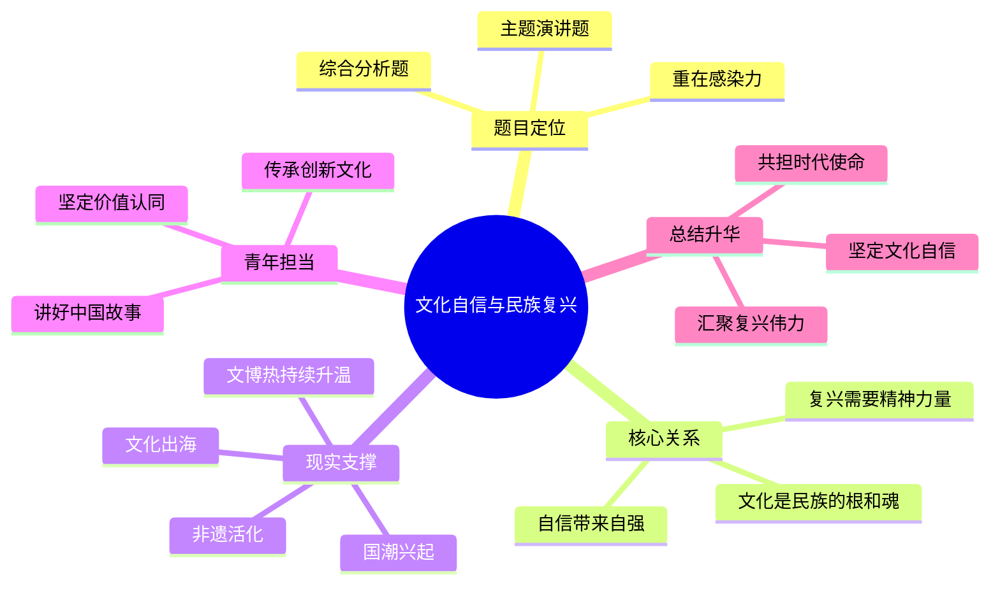

# 2026-04-09 每日一道结构化面试真题

## 1. 题目来源

说明：结构化面试真题通常不会由招录单位完整公开发布，以下内容按公开可检索页面交叉核验；题目页面均明确标注为“面试题”“面试真题”或“来源：网络及考生回忆”，不属于机构模拟题。公开题源未附标准答案，本文参考答案为非官方参考作答。

- 来源 1：[2025年2月14日国家公务员中直机关面试题](https://gwysydw.com/ms/gk/news_251208.html)
- 来源 2：[2025年2月14日国考公务员面试真题（中直机关）](https://www.kkgwy.com/ms/zt/228487.html)
- 来源 3：[〖面试真题解析〗2025年2月14日国考公务员面试真题解析（中直机关）](https://www.sohu.com/a/983722935_121148101)

## 2. 考试时间

2025 年 2 月 14 日  
国家公务员面试 中直机关

## 3. 题目

以“文化自信和民族伟大复兴”为主题，进行一个 3 分钟左右的演讲。

## 4. 解题思路

### 4.1 审题拆解

这是一道综合分析题中的主题演讲题，核心不在于堆砌大词，而在于围绕“文化自信为什么重要、和民族复兴是什么关系、青年干部和新时代青年应该怎么做”讲出逻辑、讲出情感、讲出号召力。作答时既要有一定政治站位，也要避免空泛喊口号，最好做到观点鲜明、例子可感、收束有力。

1. 题干关键词是“文化自信”“民族伟大复兴”“3 分钟左右演讲”，说明答题形式是演讲表达，不是平铺直叙的政策汇报。
2. “文化自信”是题眼，回答时要说清它为何是更基本、更深沉、更持久的力量，为什么能为民族复兴提供精神支撑。
3. “民族伟大复兴”是落脚点，说明不能只谈传统文化之美，还要谈文化传承、价值认同、精神力量和时代使命。
4. 演讲类题目要兼顾感染力和结构感，通常可以按“开篇点题—阐释意义—结合现实—发出倡议”来展开。
5. 举例时可以从中华优秀传统文化、革命文化、社会主义先进文化三个层面切入，也可以结合文博热、非遗热、国潮热、杭州亚运会、国产动画和影视作品出海等现实案例，让内容更有画面感。
6. 结尾一定要回到青年担当，体现新时代青年和公职人员要坚定文化自信、讲好中国故事、担负文化使命。

### 4.2 作答框架

建议按“五步法”展开：

1. 开篇点题：用一句有力量的话点明文化自信不是可有可无的装饰，而是民族复兴的精神根基。
2. 阐释关系：说明文化自信能够凝聚价值共识、增强民族认同、激发奋斗精神，是复兴路上的内在动力。
3. 联系现实：结合传统文化活化利用、国潮兴起、文化出海、重大赛事和文艺作品等例子，说明文化自信正在变成现实力量。
4. 发出倡议：从青年成长、公职担当、讲好中国故事、传承优秀文化等角度提出行动方向。
5. 升华收束：以“坚定文化自信、汇聚复兴伟力”作结，让演讲有气势、有回响。

### 4.3 思维导图

### 4.4 可以参考的答题模板

各位考官，我演讲的题目是《坚定文化自信，汇聚复兴伟力》。文化是一个国家、一个民族的根和魂。一个民族的复兴，不仅需要强大的物质力量，也需要强大的精神力量。今天我们讲文化自信，不是简单沉醉于过去的辉煌，而是要从五千多年文明积淀中汲取前行底气，从革命文化和社会主义先进文化中坚定价值追求，在守正创新中不断增强实现中华民族伟大复兴的志气、骨气和底气。

## 5. 参考答案（公开题源未附标准答案，以下为非官方参考作答）

各位考官，我演讲的题目是《坚定文化自信，汇聚复兴伟力》。

文化是一个国家、一个民族的根和魂。一个民族的复兴，不仅需要强大的物质力量，也需要强大的精神力量。中华民族之所以历经风雨而生生不息，靠的不只是辽阔土地和勤劳人民，也靠绵延不断的文化血脉、价值认同和精神追求。今天我们讲文化自信，就是要从中华优秀传统文化、革命文化和社会主义先进文化中汲取力量，让全体中华儿女在精神上更加独立、在价值上更加坚定、在行动上更加自觉。

文化自信之所以如此重要，是因为它关乎一个民族能不能立得住、站得稳、走得远。现实中，无论是文博场馆一票难求、非遗技艺不断出圈，还是国风国潮受到年轻人追捧，抑或越来越多中国影视作品、网络文学、网络游戏和文创产品走向世界，都说明中国人对自身文化的认同感正在不断增强。这样的认同，不是盲目排外，也不是故步自封，而是在立足自身的基础上更加从容地交流互鉴、兼收并蓄。

实现中华民族伟大复兴，必须有与之相匹配的文化自信。因为复兴不是简单的经济总量增长，也不是物质生活改善，更是精神世界的丰富、价值体系的稳固和文明形态的焕新。只有坚定文化自信，我们才能在面对各种思潮碰撞时保持清醒，在面对外部压力时保持定力，在推进中国式现代化时保持精神主动。可以说，文化自信越坚定，民族复兴的步伐就越稳健，前进的力量就越磅礴。

作为新时代青年，也作为即将走上公职岗位的青年人，我们更应自觉做文化自信的传承者、弘扬者和践行者。一方面，要主动学习中华优秀传统文化，读懂中华文明的历史厚度；另一方面，也要立足本职岗位，在公共服务、基层治理、文化传播中讲好中国故事、传播中国声音，让文化自信体现在履职尽责中，体现在为民服务中，体现在一言一行中。

我相信，只要我们始终坚定文化自信、坚持守正创新、勇于担当使命，就一定能够把深厚的文化力量转化为奋进新征程的强大动力，在全面建设社会主义现代化国家的新征程上，不断汇聚起实现中华民族伟大复兴的磅礴伟力。

我的演讲完毕。

## 6. 录制的口播稿

> PPT 共 8 页，翻页点用 **【→ 翻页】** 标注。

---

**【第 1 页 · 封面】**

今天这道题，来自 2025 年 2 月 14 日国家公务员面试中直机关场次。我这次交叉核对了公务员事业单位最新题库、考考公务员，以及搜狐上的面试真题解析页面，这几处公开页面都把这套题标注为面试题、面试真题或者来源于网络及考生回忆，所以这次整理的是公开可检索的真题回忆内容，不是机构模拟题。公开题源没有附标准答案，因此今天给大家准备的是非官方参考作答。

**【→ 翻页】**

---

**【第 2 页 · 题目】**

我们先看题目。题目非常简洁，以“文化自信和民族伟大复兴”为主题，进行一个 3 分钟左右的演讲。

这类题目看起来字不多，但其实很考验综合能力。因为它既考察考生对文化自信这一重大主题的理解深度，也考察语言表达、结构组织和现场感染力。答这道题，不能只会背几句大话，也不能只谈传统文化有多美，而是要说清楚文化自信为什么重要，它和民族复兴到底是什么关系，我们这一代青年又应该怎么做。

**【→ 翻页】**

---

**【第 3 页 · 审题拆解】**

审题时我建议抓六个点。第一，这是一道综合分析里的主题演讲题，表达方式和普通分析题不同，要更有感染力。第二，题眼是文化自信，要说明它为什么是更基本、更深沉、更持久的力量。第三，落脚点是民族伟大复兴，所以不能只谈文化保护，还要谈精神支撑和时代使命。第四，结构上最好按开篇点题、阐释意义、结合现实、发出倡议来展开。第五，例子一定要贴近当下，比如文博热、非遗热、国潮兴起、文化出海这些现实场景。第六，结尾要落到青年担当，体现新时代青年和公职人员的责任意识。

**【→ 翻页】**

---

**【第 4 页 · 作答框架·五步法】**

这道题可以按五步法来答。第一步，开篇点题，明确指出文化自信不是附属品，而是民族复兴的精神根基。第二步，阐释关系，说明文化自信能够凝聚价值共识、增强民族认同、激发奋斗精神。第三步，联系现实，举出传统文化活化、国潮兴起、文化出海等现实案例。第四步，发出倡议，从青年成长、公职担当、讲好中国故事这些角度提出行动方向。第五步，升华收束，回到坚定文化自信、汇聚复兴伟力这个主题上。

如果要套一个稳妥的开头模板，也可以直接这样说：各位考官，我演讲的题目是《坚定文化自信，汇聚复兴伟力》。文化是一个国家、一个民族的根和魂。一个民族的复兴，不仅需要强大的物质力量，也需要强大的精神力量。

**【→ 翻页】**

---

**【第 5 页 · 思维导图】**

如果把这道题画成思维导图，中间就是“文化自信与民族复兴”。第一部分是题目定位，它是主题演讲题，也是综合分析题，重点在感染力。第二部分是核心关系，也就是文化是民族的根和魂，自信带来自强，复兴需要精神力量。第三部分是现实支撑，包括非遗活化、国潮兴起、文化出海和文博热持续升温。第四部分是青年担当，要坚定价值认同、讲好中国故事、传承创新文化。最后再升华一句，就是坚定文化自信，汇聚复兴伟力，共担时代使命。

好，以上就是这道题的来源、考试时间、题目和解题思路。下面是参考答案。

**【→ 翻页】**

---

**【第 6 页 · 参考答案 1/2】**

各位考官，我演讲的题目是《坚定文化自信，汇聚复兴伟力》。

文化是一个国家、一个民族的根和魂。一个民族的复兴，不仅需要强大的物质力量，也需要强大的精神力量。中华民族之所以历经风雨而生生不息，靠的不只是辽阔土地和勤劳人民，也靠绵延不断的文化血脉、价值认同和精神追求。今天我们讲文化自信，就是要从中华优秀传统文化、革命文化和社会主义先进文化中汲取力量，让全体中华儿女在精神上更加独立、在价值上更加坚定、在行动上更加自觉。

文化自信之所以如此重要，是因为它关乎一个民族能不能立得住、站得稳、走得远。现实中，无论是文博场馆一票难求、非遗技艺不断出圈，还是国风国潮受到年轻人追捧，抑或越来越多中国影视作品、网络文学、网络游戏和文创产品走向世界，都说明中国人对自身文化的认同感正在不断增强。这样的认同，不是盲目排外，也不是故步自封，而是在立足自身的基础上更加从容地交流互鉴、兼收并蓄。

**【→ 翻页】**

---

**【第 7 页 · 参考答案 2/2】**

实现中华民族伟大复兴，必须有与之相匹配的文化自信。因为复兴不是简单的经济总量增长，也不是物质生活改善，更是精神世界的丰富、价值体系的稳固和文明形态的焕新。只有坚定文化自信，我们才能在面对各种思潮碰撞时保持清醒，在面对外部压力时保持定力，在推进中国式现代化时保持精神主动。可以说，文化自信越坚定，民族复兴的步伐就越稳健，前进的力量就越磅礴。

作为新时代青年，也作为即将走上公职岗位的青年人，我们更应自觉做文化自信的传承者、弘扬者和践行者。一方面，要主动学习中华优秀传统文化，读懂中华文明的历史厚度；另一方面，也要立足本职岗位，在公共服务、基层治理、文化传播中讲好中国故事、传播中国声音，让文化自信体现在履职尽责中，体现在为民服务中，体现在一言一行中。

我相信，只要我们始终坚定文化自信、坚持守正创新、勇于担当使命，就一定能够把深厚的文化力量转化为奋进新征程的强大动力，在全面建设社会主义现代化国家的新征程上，不断汇聚起实现中华民族伟大复兴的磅礴伟力。

我的演讲完毕。

**【→ 翻页】**

---

**【第 8 页 · CTA】**

好，以上就是今天的每日一道结构化面试真题。觉得有用的话，点赞、收藏、关注，我们明天继续。
