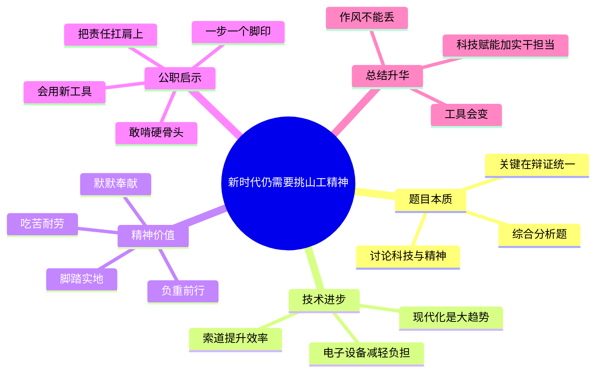

# 2026-04-10 每日一道结构化面试真题

## 1. 题目来源

说明：结构化面试真题通常不会由招录单位完整公开发布，以下内容按公开可检索页面交叉核验；题目页面均明确标注为“面试题”“面试真题”或“来源：考生回忆及网络”，不属于机构模拟题。公开题源未附标准答案，本文参考答案为非官方参考作答。

- 来源 1：[2025年3月8日下午山东省考公务员面试题（第三套）](https://www.gwysydw.com/ms/dqgwy/news_251460.html)
- 来源 2：[2025年3月8日下午山东省考公务员面试题（第三套）](https://blog.sina.com.cn/s/blog_17bace72101034xc8.html)
- 来源 3：[面试真题 | 2025年3月7日-9日山东公务员面试真题汇总（考生回忆版）](https://www.sohu.com/a/872044015_121124034)

## 2. 考试时间

2025 年 3 月 8 日（下午）
山东省公务员面试 第三套

## 3. 题目

泰山行山道上原来有不少挑山工，后来有了索道，现在有电子狗运货物，有人说挑山工要退出历史舞台了，也有人说新时代也需要“挑山工”，请谈谈你的看法。

## 4. 解题思路

### 4.1 审题拆解

这是一道典型的综合分析题，而且带有很强的价值判断色彩。题目并不是单纯让我们讨论“挑山工这个职业还存不存在”，而是借“挑山工”这个山东本土意象，考察考生能否正确处理“技术进步”和“精神传承”的关系。作答时要避免二选一式站队，最好形成“体力搬运方式会变，但挑山工精神不能丢；新时代既要善用科技，也要保持负重前行、脚踏实地的作风”这一主线。

1. 题干前半部分讲“索道”“电子狗运货物”，说明技术革新在提升效率、降低成本、减轻体力劳动负担，这是现代化发展的客观趋势，不能逆技术潮流而谈。
2. 题干后半部分把争议点落在“挑山工是否退出历史舞台”，这里的“挑山工”既可以指具体职业形态，也可以指吃苦耐劳、一步一个脚印、负重前行的精神品质。
3. 这道题不能简单回答“退出”或者“不会退出”，而要辩证分析：物理意义上的传统挑山工可能减少，但精神意义上的“挑山工”在新时代仍然是干部干事创业的重要品格。
4. 从政府治理视角看，技术手段越先进，越需要干部既懂创新、会借力，也能在困难面前不躲不绕、不等不靠，真正把工作扛在肩上。
5. 作答结构上可以按“表明观点—分析技术进步的必要性—阐明挑山工精神的时代价值—联系青年干部和公职岗位谈落实”来展开。
6. 结尾最好回到公职身份，强调新时代需要的不是守着旧工具不放，而是既有现代化能力，也有挑山工式作风，把“科技赋能”和“实干担当”统一起来。

### 4.2 作答框架

建议按“五步法”展开：

1. 亮明观点：传统搬运方式会因技术升级而改变，但挑山工精神不会过时，新时代依然需要“挑山工”。
2. 认可变化：指出索道、机械设备、智能工具替代高强度体力劳动，是科技进步和景区治理现代化的体现。
3. 提炼精神：强调挑山工身上体现的是脚踏实地、迎难而上、负重前行、默默奉献，这些品质任何时代都稀缺。
4. 联系实际：结合青年干部、公职岗位、基层治理，说明工作中既要会用新技术，也要有啃硬骨头、走实每一步的作风。
5. 升华落脚：总结为“工具可以更新，精神不能断档；方式可以迭代，担当始终在线”。

### 4.3 思维导图

### 4.4 可以参考的答题模板

各位考官，我认为“挑山工”如果只理解为传统的人力搬运方式，确实会随着科技进步逐渐减少；但如果把它理解为一种负重前行、脚踏实地、迎难而上的精神品质，那么新时代不仅仍然需要，而且比任何时候都更需要。因为现代化发展解决的是“怎么干得更快”，而挑山工精神回答的是“遇到难题时谁来扛、怎么扛、能不能扛到底”。

## 5. 参考答案（公开题源未附标准答案，以下为非官方参考作答）

各位考官，我认为这两种说法看似对立，实际上分别说中了问题的一个侧面。传统意义上靠肩挑背扛运送物资的挑山工，随着索道、机械设备和智能运输工具的出现，的确会逐步减少，这是科技进步和社会发展的必然结果；但从精神层面看，新时代依然需要“挑山工”，而且这种精神在今天依旧十分宝贵。

首先，必须承认技术替代是好事。无论是索道还是电子设备，本质上都是为了提高效率、降低成本、减轻劳动强度，也能让景区管理更加安全、规范、科学。如果面对技术进步还停留在“只能靠老办法”的思维里，那就不符合高质量发展的要求。新时代推进中国式现代化，本来就要善于用新技术、新工具、新机制解决老问题。

但另一方面，技术可以替代体力劳动，却替代不了精神品质。挑山工最可贵的，不只是肩上挑着货，更是身上有韧劲、脚下有定力、心中有责任。一步一个脚印往上走，遇到陡坡不退缩，肩上再重也咬牙坚持，这种负重前行、默默奉献、认准目标就踏实干到底的精神，恰恰是新时代干部队伍和青年群体最需要的品质。特别是在基层治理、民生服务、攻坚克难的工作中，很多事情没有捷径可走，最终还得靠这种踏踏实实、迎难而上的劲头把事情办成。

对青年干部来说，这道题给我们的启示就是，既要会用“索道”和“电子狗”，也要保持“挑山工”的状态。前者意味着要提高数字化能力、创新能力、统筹能力，用科学方法提升工作质效；后者意味着在面对群众诉求、复杂矛盾和急难任务时，不能只想着绕着走、推着走，而要主动扛、接着干、持续干。真正成熟的干部，不是守着旧方式不变，而是在拥抱新技术的同时，始终保持脚踏实地的作风和久久为功的耐力。

所以，我的看法是，新时代不一定还需要原来的搬运方式，但一定还需要挑山工精神。工具可以更新，岗位可以变化，方法可以迭代，但负重前行、实干担当、一步一个脚印的作风永远不会退出历史舞台。只有把科技赋能和挑山工精神统一起来，我们才能把前进道路上的每一段“山路”真正走稳、走实、走好。

## 6. 录制的口播稿

> PPT 共 8 页，翻页点用 **【→ 翻页】** 标注。

---

**【第 1 页 · 封面】**

今天这道题，来自 2025 年 3 月 8 日下午山东省公务员面试第三套。我这次交叉核对了 `gwysydw` 的当日真题页、Sina 博客收录页，以及搜狐上的山东省考真题汇总页，这三处公开页面都把内容标注成面试题、面试真题或者考生回忆，不是机构模拟题。公开题源没有附标准答案，因此今天给大家准备的是非官方参考作答。

**【→ 翻页】**

---

**【第 2 页 · 题目】**

我们先看题目。题目是这样的：泰山行山道上原来有不少挑山工，后来有了索道，现在有电子狗运货物，有人说挑山工要退出历史舞台了，也有人说新时代也需要“挑山工”，请谈谈你的看法。

这道题表面上谈的是泰山上的挑山工，实际上考的不是一个职业会不会消失，而是我们怎么看待科技进步和精神传承的关系。也就是说，答题不能停留在景区搬运方式的变化上，而要往更深一层去谈，谈新时代到底还需不需要挑山工精神。

**【→ 翻页】**

---

**【第 3 页 · 审题拆解】**

审题时我建议抓六个点。第一，题目先讲索道和电子设备，说明技术进步是客观趋势，不能逆着现代化去谈。第二，题目的核心争议不在工具，而在“挑山工”这个词到底是职业还是精神。第三，作答时不能简单二选一，而是要辩证分析，传统搬运方式会减少，但挑山工精神不能丢。第四，从公职视角看，这种精神体现的是负重前行、脚踏实地、迎难而上。第五，结构上可以按表态、分析技术进步、提炼精神价值、联系干部实际来展开。第六，结尾一定要落在新时代干部既要会用新技术，也要保有老作风。

**【→ 翻页】**

---

**【第 4 页 · 作答框架·五步法】**

这道题可以按五步法来答。第一步，亮明观点，明确指出传统搬运方式会变，但挑山工精神不会过时。第二步，认可变化，说明索道、机械、智能设备替代高强度体力劳动，是现代化发展的体现。第三步，提炼精神，把挑山工身上的吃苦耐劳、一步一个脚印、默默奉献提炼出来。第四步，联系实际，说明青年干部在工作中既要会用新工具，也要敢啃硬骨头。第五步，升华落脚，概括为工具可以更新，精神不能断档。

如果要套一个稳妥的开头模板，也可以直接这样说：各位考官，我认为“挑山工”如果只理解为传统的人力搬运方式，确实会随着科技进步逐渐减少；但如果把它理解为一种负重前行、脚踏实地、迎难而上的精神品质，那么新时代不仅仍然需要，而且比任何时候都更需要。

**【→ 翻页】**

---

**【第 5 页 · 思维导图】**

如果把这道题画成思维导图，中间就是“新时代仍需要挑山工精神”。第一部分是题目本质，它是一道综合分析题，重点是处理科技和精神的关系。第二部分是技术进步，包括索道提升效率、电子设备减轻负担，说明现代化是大趋势。第三部分是精神价值，也就是负重前行、脚踏实地、吃苦耐劳、默默奉献。第四部分是公职启示，干部既要会用新工具，也要敢啃硬骨头、一步一个脚印，把责任真正扛在肩上。最后再升华一句，就是工具会变，作风不能丢，科技赋能要和实干担当统一起来。

好，以上就是这道题的来源、考试时间、题目和解题思路。下面是参考答案。

**【→ 翻页】**

---

**【第 6 页 · 参考答案 1/2】**

各位考官，我认为这两种说法看似对立，实际上分别说中了问题的一个侧面。传统意义上靠肩挑背扛运送物资的挑山工，随着索道、机械设备和智能运输工具的出现，的确会逐步减少，这是科技进步和社会发展的必然结果；但从精神层面看，新时代依然需要“挑山工”，而且这种精神在今天依旧十分宝贵。

首先，必须承认技术替代是好事。无论是索道还是电子设备，本质上都是为了提高效率、降低成本、减轻劳动强度，也能让景区管理更加安全、规范、科学。如果面对技术进步还停留在只能靠老办法的思维里，那就不符合高质量发展的要求。新时代推进中国式现代化，本来就要善于用新技术、新工具、新机制解决老问题。

**【→ 翻页】**

---

**【第 7 页 · 参考答案 2/2】**

但另一方面，技术可以替代体力劳动，却替代不了精神品质。挑山工最可贵的，不只是肩上挑着货，更是身上有韧劲、脚下有定力、心中有责任。一步一个脚印往上走，遇到陡坡不退缩，肩上再重也咬牙坚持，这种负重前行、默默奉献、认准目标就踏实干到底的精神，恰恰是新时代干部队伍和青年群体最需要的品质。特别是在基层治理、民生服务、攻坚克难的工作中，很多事情没有捷径可走，最终还得靠这种踏踏实实、迎难而上的劲头把事情办成。

对青年干部来说，这道题给我们的启示就是，既要会用“索道”和“电子狗”，也要保持“挑山工”的状态。前者意味着要提高数字化能力、创新能力、统筹能力，用科学方法提升工作质效；后者意味着在面对群众诉求、复杂矛盾和急难任务时，不能只想着绕着走、推着走，而要主动扛、接着干、持续干。真正成熟的干部，不是守着旧方式不变，而是在拥抱新技术的同时，始终保持脚踏实地的作风和久久为功的耐力。

所以，我的看法是，新时代不一定还需要原来的搬运方式，但一定还需要挑山工精神。工具可以更新，岗位可以变化，方法可以迭代，但负重前行、实干担当、一步一个脚印的作风永远不会退出历史舞台。只有把科技赋能和挑山工精神统一起来，我们才能把前进道路上的每一段“山路”真正走稳、走实、走好。

**【→ 翻页】**

---

**【第 8 页 · CTA】**

好，以上就是今天的每日一道结构化面试真题。觉得有用的话，点赞、收藏、关注，我们明天继续。
