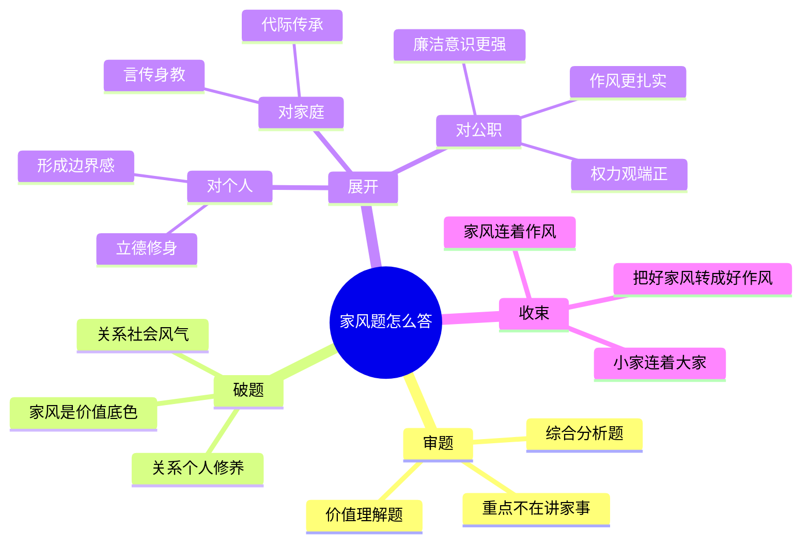

# 2026-04-11 每日一道结构化面试真题

## 1. 题目来源

说明：结构化面试真题通常不会由招录单位完整公开发布，以下内容按公开可检索页面交叉核验。三处公开页面都写明了考试日期、系统信息和题目内容，其中 `考考公务员` 明确标注为“财政部监管局面试真题”，`公务员事业单位最新题库` 与 `公务员备考网` 标注为“财政部面试题”，且均注明来源为“考生回忆及网络”或“仅供参考”。因此，本题可认定为**真实考试回忆版真题**，但并非官方公布版，真实性评级为“中”。

- 来源 1：[2025年2月19日下午国家公务员财政部监管局面试真题](https://www.kkgwy.com/ms/zt/228662.html)（考考公务员，标题明确写“面试真题”，并标注为回忆整理版）
- 来源 2：[2025年2月19日下午国家公务员财政部面试题](https://gwysydw.com/ms/gk/news_251271.html)（公务员事业单位最新题库，注明“来源：网络及考生回忆”）
- 来源 3：[2025年2月19日下午国家公务员财政部面试题](https://www.benet-wh.com.cn/guokao/mianshi/31.html)（公务员备考网，注明“本试题来源于考生回忆及网络，仅供参考”）

补充判断：

1. 三处来源的结构化第 1 题题干完全一致，均为“关于‘家庭家风’，谈谈你的理解。”
2. 三处来源均能对应到同一考试日期，且都把这组题归到国家公务员财政部系统场次。
3. 公开页面未见官方答题要点，也未见完整第 4、5 题，因此本题属于**回忆版真题**，而不是官方原卷。

## 2. 考试时间

2025 年 2 月 19 日（下午）

可确认信息：

1. 考试类别为国家公务员面试。
2. `考考公务员` 页面写明为“财政部监管局面试真题”。
3. 其余两页写为“财政部面试题”，未进一步细化到具体地区监管局岗位。

因此，本题的考试时间可以明确到**2025-02-19 下午**；考试系统可以判断为**国家公务员财政部监管局 / 财政部系统场次**，更细岗位信息未明确。

## 3. 题目

关于“家庭家风”，谈谈你的理解。

## 4. 解题思路

### 4.1 审题拆解

这是一道典型的综合分析题，也带有较强的价值认知色彩。题干很短，但考查并不浅。它不是让考生泛泛谈“家庭很重要”，也不是让考生讲个人家史，而是考查考生能否把“家庭家风”上升到个人修养、干部作风、廉洁自律和社会风气建设的层面去理解。作答时要避免空谈大道理，更要避免把“家风”只讲成“孝敬父母、家庭和睦”这种过于生活化的表达，最好形成“家风是做人做事做官的重要起点，好的家风能涵养品德、端正作风、影响社会风气”这一主线。

1. 题型识别：这是综合分析里的价值理解题，重点不在讲故事，而在把概念讲清、把现实意义讲透。
2. 核心内涵：家庭家风既是一个家庭长期形成的价值准则和行为习惯，也是个人世界观、价值观、权力观的重要起点。
3. 作答重点：既要讲家风对个人成长的影响，也要讲家风与党风、政风、社风之间的关联，尤其要落到公职岗位的廉洁、责任、规矩意识上。
4. 常见误区：一是把答案答成“孝道作文”，只讲温情不讲治理；二是把答案答成“口号堆砌”，只讲意义不讲怎么践行。
5. 结构建议：可以按“解释概念与表态认同、分析家风的个人与社会价值、联系公职岗位谈落实、总结升华”来展开。
6. 身份落脚：如果未来走上公职岗位，家风不仅是私德问题，也会外化为作风、纪律观念和群众观念，因此要把修身齐家和履职尽责统一起来。

### 4.2 作答框架

建议按“五步法”展开：

1. 破题表态：家风看似是家庭内部问题，实则关乎一个人的品行底色和社会风气建设，我对此高度认同。
2. 阐释内涵：说明家风不是一句口号，而是家庭成员在长期相处中形成的价值标准、行为边界和处事方式。
3. 分析意义：从个人成长、家庭传承、社会文明三个层面说明好家风的重要性。
4. 联系岗位：结合公职身份，强调家风会影响权力观、群众观、廉洁观，好的家风有助于守住底线、端正作风。
5. 收束提升：总结为“家风正，则作风实、品行稳、事业远”，要把好家风转化为干事创业和廉洁从政的内在力量。

### 4.3 思维导图

### 4.4 可以参考的答题模板

各位考官，我认为家庭家风虽然首先体现为一个家庭内部的精神气质和行为规范，但它绝不仅仅是“家里的事”，而是一个人成长成才的起点，也是社会风气的重要组成部分。对个人而言，家风决定一个人最早接受什么样的价值引导；对社会而言，千千万万个家庭的家风汇聚起来，就会影响社会风尚；对公职人员而言，家风更会外化为作风、纪律和用权边界。因此，理解家庭家风，既要看到它在修身齐家中的作用，也要看到它在廉洁从政、为民服务中的现实意义。

## 5. 参考答案（整理版参考作答示例）

各位考官，我认为家庭家风看似是“小切口”，实际上反映的是一个人的品德养成、一个家庭的精神传承，甚至一个社会的文明底色。家风不是挂在墙上的一句家训，也不是逢年过节才提起的道理，而是家庭成员在长期相处中形成的价值标准、行为规范和处事习惯。一个人待人是否真诚、做事是否踏实、面对利益是否守得住底线，往往都能从家风中找到根源。

首先，家庭家风是个人成长的第一课堂。一个人小时候最先接触的，不是制度条文，而是父母长辈的言传身教。如果一个家庭崇尚勤俭、诚信、责任和规矩，孩子耳濡目染之下，就更容易形成正确的是非观、责任观和边界感。反过来说，如果家风松散、是非模糊，甚至把投机取巧、好逸恶劳当成“聪明”，那个人在进入社会以后也容易在原则问题上失守。因此，好家风本质上是在给一个人立德修身打基础。

其次，家风虽小，却会影响社会风气。千家万户的家风汇聚起来，就是整个社会的文明氛围。如果越来越多的家庭重视诚信友善、尊老爱幼、勤劳节俭、公私分明，那么社会运行就会更有秩序，人与人之间的信任也会更强。相反，如果家庭教育中缺少规则意识、责任意识，就容易在社会层面表现为不守规矩、不讲诚信、急功近利。所以说，家风不仅是“家务事”，也是社会治理中不可忽视的基础性力量。

最后，从公职岗位来看，家风和作风、政风之间有着非常紧密的联系。对于干部而言，家风往往会影响一个人的权力观、利益观和群众观。一个重视家教家风的人，更容易懂得敬畏纪律、珍惜岗位、守住底线；一个能够把家庭中的责任感、节制感、规则感带到工作中的人，也更容易做到公私分明、廉洁自律、务实为民。现实中，一些干部出现作风问题、廉洁问题，往往也和家风不严、家教缺位有关。因此，重视家庭家风，不只是修身问题，也是履职尽责和廉洁从政的题中之义。

如果我有机会走上公职岗位，我会把家风建设理解为一种长期修炼。一方面，从自身做起，把诚实守信、踏实做事、公私分明落到日常工作和生活细节中；另一方面，也会把良好的家庭观念转化为对组织、对群众、对岗位的责任感，做到心中有戒、做事有尺、用权有度。只有把好家风真正内化为好品行、好作风，才能在工作中走得更稳、更远。

## 6. 口播稿

今天这道题，来自 2025 年 2 月 19 日下午国家公务员财政部系统场次。公开题源里，`考考公务员` 明确写的是“财政部监管局面试真题”，`公务员事业单位最新题库` 和 `公务员备考网` 写的是“财政部面试题”。这三处页面都把题目来源标注为考生回忆或者网络整理，而且结构化第 1 题题干完全一致，所以这道题可以作为真实考试回忆版真题来使用，但它不是官方原卷，这一点要先说清楚。

这道题的题干非常短，只有一句话：“关于‘家庭家风’，谈谈你的理解。”越是这种短题，越容易答飘。因为很多同学一看到“家风”，就容易往温情叙事上走，只谈尊老爱幼、家庭和睦；还有一些同学会一路上价值口号，但跟岗位实际联系不起来。真正稳妥的答法，是把它看成一道综合分析里的价值理解题，从个人修养、家庭传承、社会风气和公职作风四个层面去讲。

先说审题重点。第一，这不是让你分享个人家庭故事，所以不要把重点放在“我家里怎么样”。第二，家风不仅是家庭内部氛围，更是一个人价值观形成的源头。第三，如果你是参加公职类面试，就一定要把家风和干部作风、廉洁意识、公私分明联系起来。也就是说，这道题最核心的逻辑，是从“小家”的家风，讲到“大家”的风气，再落到“做事做官”的作风。

如果按思维导图来展开，可以分成四层。第一层是审题，明确它是一道综合分析题，重点不在讲家事，而在讲价值底色。第二层是破题，点出家风关系个人修养，也关系社会风气。第三层是展开，可以分三个角度讲：对个人来说，家风帮助一个人立德修身、形成边界感；对家庭来说，家风靠言传身教去代际传承；对公职岗位来说，家风会影响一个人的权力观、廉洁观和群众观。第四层是收束，升华成一句话，就是“小家连着大家，家风连着作风，把好家风转化成好作风”。

这道题还有一个非常实用的答题模板。你完全可以这样开头：家庭家风虽然首先体现为一个家庭内部的精神气质和行为规范，但它绝不仅仅是家里的事，而是一个人成长成才的起点，也是社会风气的重要组成部分。接着顺势往下讲，对个人意味着什么，对社会意味着什么，对未来履职意味着什么。这样开头的好处，是站位比较稳，而且后面的展开空间很大。

再说答案组织。第一段先把概念和立场讲清楚，说明家风不是一句挂在墙上的话，而是长期形成的价值标准和行为习惯。第二段讲个人成长，说明一个人小时候接受什么样的家教，就更容易形成什么样的是非观和责任观。第三段讲社会层面，强调千家万户的家风会汇聚成整个社会的文明氛围。第四段重点落在公职岗位上，说明家风和作风、政风之间关系很紧，家风正的人，更容易做到公私分明、守住底线、踏实为民。最后再表态，说明自己未来会把好家风转化成好作风。

还要提醒一点，这道题公开题源没有官方标准答案，所以我们能整理的只能是参考作答示例，不能把机构整理版包装成官方答案。这也是做真题资料库时必须保持的严谨性。

下面是参考答案。
